# Hiroz

<strong>High-performance Interoperable Robotics on Zenoh</strong>

Built by the [Zenoh](https://zenoh.io) team at [ZettaScale](https://www.zettascale.tech)

---

## Overview

**Hiroz** is a Zenoh-native ROS 2 stack that:

- Provides a **pure-Rust ROS 2 implementation** built directly on Zenoh
- **Preserves portability** for RCL-C/CPP/Py-based applications
- Delivers **optimized performance** for Rust users
- **Interoperates seamlessly** with Zenoh RMW-based ROS 2

> **ROS 2 without ROS.** Full compatibility. Zero ROS package dependencies.

## Status

**Hiroz** is experimental software. It is tested with ROS 2 Jazzy, Humble, and Kilted. We make no guarantees with respect to other official distributions.

## Documentation

**[Read the Book](https://zettascalelabs.github.io/hiroz/)** for comprehensive documentation including:

- Installation and build instructions
- Examples and tutorials
- API reference
- Feature flags and configuration
- Contributing guidelines

**Local Development:** `mdbook serve book`

## License

[View license](LICENSE)

## Contributing

Contributions are welcome! Please see [CONTRIBUTING.md](CONTRIBUTING.md) for details.
