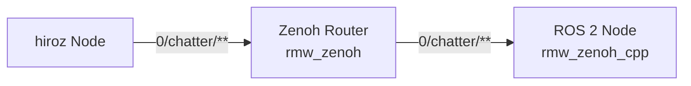

# Key Expression Format

**hiroz maps ROS 2 entities (topics, services, actions) to Eclipse Zenoh key expressions using the RmwZenoh format.** The independent `hiroz-protocol` crate provides this mapping to ensure wire compatibility with [`rmw_zenoh_cpp`](https://github.com/ros2/rmw_zenoh), the official ROS 2 Zenoh middleware.

## Key Expression Patterns

```text
Topic keys:      <domain_id>/<topic>/<type>/<hash>
Liveliness:      @ros2_lv/<domain_id>/<entity_kind>/<namespace>/<name>/...
```

**Example topic keys:**

```text
0/chatter/std_msgs::msg::dds_::String_/RIHS01_...
5/robot/sensors/camera/sensor_msgs::msg::dds_::Image_/RIHS01_...
```

## Key Expression Behavior (IMPORTANT)

Understanding how hiroz converts topic names to key expressions is critical for debugging:

### Topic Key Expressions (For Data Routing)

**ALL entity types** (publishers, subscriptions, services, clients, actions) use `strip_slashes()` behavior:

- Removes **leading** and **trailing** slashes only
- **Preserves internal** slashes for hierarchical routing
- Enables multi-segment topic names

**Examples:**

| ROS 2 Topic Name | Topic Key Expression | ✓/✗ |
|------------------|---------------------|-----|
| `/chatter` | `0/chatter/...` | ✅ Correct |
| `/robot/sensors` | `0/robot/sensors/...` | ✅ Correct |
| `/a/b/c` | `0/a/b/c/...` | ✅ Correct |
| `/talker/service` | `0/talker/service/...` | ✅ Correct |

**Why preserve slashes?**

- Zenoh uses `/` for hierarchical routing
- Enables wildcard subscriptions: `0/robot/**`
- Human-readable key expressions

### Liveliness Tokens (For Discovery)

**ALL fields** in liveliness tokens use `mangle_name()` behavior:

- Replaces **all** `/` with `%`
- Ensures unambiguous parsing of entity metadata
- Machine-parsable format for discovery protocol

**Examples:**

| ROS 2 Name | Liveliness Field | ✓/✗ |
|-----------|-----------------|-----|
| `/chatter` | `%chatter` | ✅ Correct |
| `/robot/sensors` | `%robot%sensors` | ✅ Correct |
| `/my_node` | `%my_node` | ✅ Correct |

**Why mangle slashes?**

- Liveliness tokens have fixed structure: `@ros2_lv/<domain>/<kind>/<ns>/<name>/...`
- Prevents ambiguity when parsing fields
- Ensures reliable entity discovery

### Why Two Different Behaviors?

This is **intentional design** in [`rmw_zenoh_cpp`](https://github.com/ros2/rmw_zenoh), not an inconsistency:

- **Topic keys**: Human-readable, hierarchical (optimized for Zenoh routing)
- **Liveliness**: Machine-parsable, unambiguous (optimized for discovery protocol)

!!! tip
    If multi-segment topics like `/robot/sensors/camera` don't receive messages, check your hiroz version. Versions before 0.1.0 had a bug where publishers incorrectly mangled topic key expressions.

## Architecture



## Key Expression Generation Details

Understanding how `hiroz-protocol` generates key expressions helps with debugging and monitoring.

### Topic Key Expression Structure

```text
<domain_id>/<topic_stripped>/<type>/<hash>
```

**Components:**

1. **Domain ID**: ROS 2 domain (e.g., `0`, `5`)
2. **Topic (stripped)**: Topic name with leading/trailing slashes removed, internal slashes preserved
3. **Type**: Mangled message type (e.g., `std_msgs::msg::dds_::String_`)
4. **Hash**: Type hash for compatibility (e.g., `RIHS01_...`)

**Example:**

```text
Topic: /robot/sensors/camera
Type:  sensor_msgs/msg/Image
Hash:  RIHS01_abc123...

Key Expression:
0/robot/sensors/camera/sensor_msgs::msg::dds_::Image_/RIHS01_abc123...
```

### Liveliness Token Structure

```text
@ros2_lv/<domain>/<entity_kind>/<zid>/<id>/<namespace>/<name>/<type>/<hash>/<qos>
```

**hiroz mangles all name fields** (/ → %):

```text
Namespace: /robot/arm  →  %robot%arm
Name:      /gripper    →  %gripper
```

**Example:**

```text
@ros2_lv/0/MP/01234567890abcdef/1/%robot%arm/%gripper/std_msgs::msg::String_/RIHS01_.../qos_string
```

## hiroz-protocol Crate

The independent `hiroz-protocol` crate provides the key expression logic:

- `no_std` compatible (with `alloc`)
- Language-agnostic protocol layer (FFI-ready)
- Comprehensive unit tests
- Type-safe API

**Using hiroz-protocol directly:**

```rust
use hiroz_protocol::{KeyExprFormat, entity::*};

let format = KeyExprFormat::default(); // RmwZenoh

// Generate topic key expression
let topic_ke = format.topic_key_expr(&entity)?;

// Generate liveliness token
let lv_ke = format.liveliness_key_expr(&entity, &zid)?;

// Parse liveliness token back to entity
let parsed_entity = format.parse_liveliness(&lv_ke)?;
```

See the [hiroz-protocol crate](https://github.com/ZettaScaleLabs/hiroz/tree/main/crates/hiroz-protocol) for details.

## Troubleshooting

### Multi-Segment Topics Not Working?

**Symptom:** Publisher publishes to `/robot/sensors/camera` but subscriber never receives messages.

**Cause:** Old versions of hiroz (before 0.1.0) incorrectly mangled slashes in topic key expressions.

**Fix:** Update to hiroz 0.1.0+ which correctly uses `strip_slashes()` for all topic key expressions.

**Verify:** Enable debug logging to check key expressions:

```bash
RUST_LOG=hiroz=debug cargo run --example z_pubsub
```

Look for key expressions like:

```text
✅ Correct:  0/robot/sensors/camera/sensor_msgs::msg::Image_/...
❌ Wrong:    0/robot%sensors%camera/sensor_msgs::msg::Image_/...
```

### No Messages Between hiroz and rmw_zenoh_cpp?

**Check type hash:** Enable debug logging and compare type hashes:

```bash
RUST_LOG=hiroz=debug cargo run
```

Type hashes must match between hiroz and rmw_zenoh_cpp. If they don't, you may have:

- Different message definitions
- Different ROS 2 distros
- Outdated generated messages
