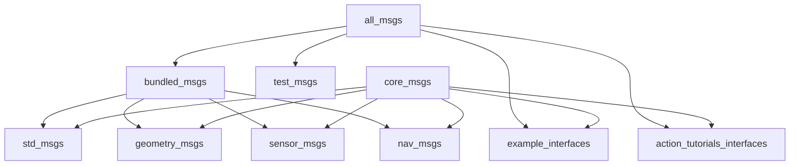
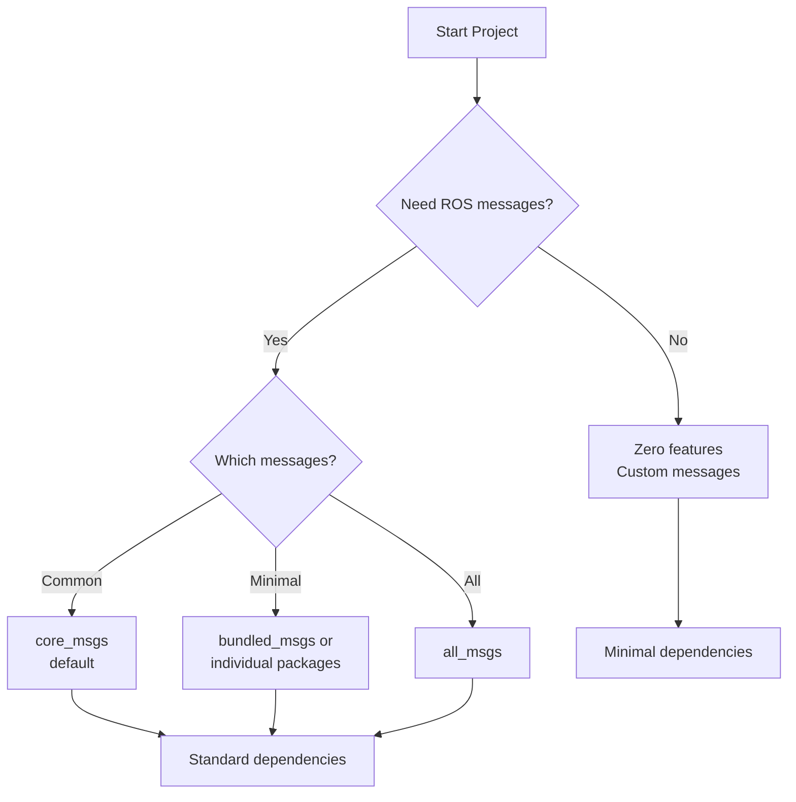

# Feature Flags

**Fine-grained control over dependencies and functionality through Cargo feature flags.** Build exactly what you need, from zero-dependency core to full ROS 2 integration, without carrying unused code.

!!! success
    Feature flags enable pay-per-use dependencies. Start minimal and enable features incrementally as requirements grow.

## Feature Categories

| Category | Purpose | Example Features |
|----------|---------|------------------|
| **Distribution** | Target specific ROS 2 versions | `humble`, `jazzy`, `rolling` |
| **Message Packages** | Enable ROS 2 message types | `std_msgs`, `geometry_msgs` |
| **Serialization** | Additional encoding formats | `protobuf` |
| **Integration** | External system bindings | `rcl-z` |

## hiroz Core Features

### `protobuf`

Enables Protocol Buffers serialization using `prost`.

```bash
cargo build -p hiroz --features protobuf
```

**Use cases:**

- Schema evolution support
- Language-agnostic data exchange
- Efficient binary encoding
- Familiar protobuf ecosystem

**Dependencies:** `prost`, `prost-types`

!!! info
    Protobuf is optional. CDR serialization (default) provides full ROS 2 compatibility without additional dependencies.

## Distribution Compatibility Features

**hiroz defaults to ROS 2 Jazzy**. Use distribution features to target other ROS 2 versions.

### `jazzy` (default)

Targets ROS 2 Jazzy Jalisco with modern type hash support.

```bash
# Automatically enabled (default)
cargo build

# Explicitly enable
cargo build --features jazzy
```

**Features:**

- ✅ Type hash support (RIHS01)
- ✅ Shared memory optimization
- ✅ Modern ROS 2 protocol

### `humble`

Targets ROS 2 Humble Hawksbill (LTS) with legacy compatibility.

```bash
# Disable defaults and enable humble
cargo build --no-default-features --features humble
```

**Features:**

- ❌ No type hash (uses placeholder)
- ❌ No shared memory support
- ✅ LTS support until 2027
- ✅ Compatible with rmw_zenoh_cpp v0.1.8

**Important:** Humble requires `--no-default-features` to avoid conflicts with the jazzy default.

### `kilted`

Targets ROS 2 Kilted Kaiju with modern type hash support.

```bash
cargo build --features kilted
```

**Features:**

- ✅ Type hash support (RIHS01)
- ✅ Shared memory optimization
- ✅ Modern ROS 2 protocol

### `lyrical`

Targets ROS 2 Lyrical Luth (LTS, May 2026–May 2031) with modern type hash support.

```bash
cargo build --features lyrical
```

**Features:**

- ✅ Type hash support (RIHS01)
- ✅ Shared memory optimization
- ✅ Modern ROS 2 protocol
- ✅ LTS support until 2031

### `rolling`

Target Rolling distribution:

```bash
cargo build --features rolling
```

**See also:** [ROS 2 Distribution Compatibility](../getting-started/distro-compatibility.md) for detailed documentation.

### `rcl-z`

Enables RCL (ROS Client Library) integration for C/C++ interoperability.

```bash
cargo build -p hiroz --features rcl-z
```

**Use cases:**

- Integrating with existing RCL-based code
- Leveraging C/C++ ROS 2 libraries
- Hybrid Rust/C++ applications

**Requirements:** ROS 2 installation with RCL libraries

!!! warning
    This feature requires you to source ROS 2 before building. See [Building Guide](../getting-started/building.md) for setup instructions.

## hiroz-msgs Features

### Default Features

The default build includes commonly used message types via `core_msgs`:

```bash
cargo build -p hiroz-msgs
```

**Includes:**

- `std_msgs` - Basic types (String, Int32, etc.)
- `geometry_msgs` - Spatial types (Point, Pose, Transform)
- `sensor_msgs` - Sensor data (LaserScan, Image, Imu)
- `nav_msgs` - Navigation (Path, Odometry, OccupancyGrid)
- `example_interfaces` - Tutorial services (AddTwoInts)
- `action_tutorials_interfaces` - Tutorial actions (Fibonacci)

!!! tip
    All messages are vendored in assets - no ROS 2 installation required. Feature flags control which packages to include in your build.

### Individual Package Features

hiroz bundles all packages in assets so they work without ROS 2:

| Feature | Package | Use Case |
|---------|---------|----------|
| `std_msgs` | Standard messages | Strings, numbers, arrays |
| `geometry_msgs` | Geometric primitives | Points, poses, transforms |
| `sensor_msgs` | Sensor data | Cameras, lidars, IMUs |
| `nav_msgs` | Navigation | Paths, maps, odometry |
| `example_interfaces` | Tutorial services | AddTwoInts, Fibonacci |
| `action_tutorials_interfaces` | Tutorial actions | Fibonacci action |
| `rcl_interfaces` | Parameter service types | Parameter service client interop |
| `test_msgs` | Test types | Testing and validation |

**Usage:**

```bash
# Single package
cargo build -p hiroz-msgs --no-default-features --features std_msgs

# Multiple packages
cargo build -p hiroz-msgs --no-default-features --features "std_msgs,geometry_msgs"

# Default (core_msgs)
cargo build -p hiroz-msgs
```

### Convenience Aliases

**`core_msgs` (default):**

The most commonly used packages for ROS 2 development.

```bash
cargo build -p hiroz-msgs  # Uses core_msgs by default
```

Enables: `std_msgs`, `geometry_msgs`, `sensor_msgs`, `nav_msgs`, `example_interfaces`, `action_tutorials_interfaces`

**`common_interfaces`:**

```bash
cargo build -p hiroz-msgs --features common_interfaces
```

Enables: `std_msgs`, `geometry_msgs`, `sensor_msgs`

**`bundled_msgs`:**

```bash
cargo build -p hiroz-msgs --features bundled_msgs
```

Enables: `std_msgs`, `geometry_msgs`, `sensor_msgs`, `nav_msgs`

**`robotics`:**

Alias for `core_msgs`.

**`all_msgs`:**

```bash
cargo build -p hiroz-msgs --features all_msgs
```

Enables: All available packages including `test_msgs`

### Protobuf Types

Generate protobuf types alongside ROS messages:

```bash
cargo build -p hiroz-msgs --features protobuf
```

**Note:** Requires `hiroz/protobuf` feature enabled as well.

## hiroz-codegen Features

### Protobuf Code Generation

Enable protobuf code generation support:

```bash
cargo build -p hiroz-codegen --features protobuf
```

**Use case:** Building tools that generate protobuf code from ROS messages

## Feature Dependency Graph



## Common Feature Combinations

### Minimal Development

Core library only, no messages:

```bash
cargo build -p hiroz
```

**Dependencies:** Rust, Cargo
**Use case:** Custom messages only

### Standard Development

Core with common message types:

```bash
cargo build -p hiroz-msgs  # Uses default common_interfaces
cargo build -p hiroz
```

**Dependencies:** Rust, Cargo
**Use case:** Most applications

### Full Message Set

All available message packages:

```bash
cargo build -p hiroz-msgs --features all_msgs
```

**Dependencies:** Rust, Cargo
**Use case:** Access to all bundled message types including test_msgs

### RCL Integration

For C/C++ ROS 2 interoperability:

```bash
source /opt/ros/jazzy/setup.bash
cargo build -p rcl-z
```

**Dependencies:** Rust, Cargo, ROS 2
**Use case:** Hybrid Rust/C++ applications

### Protobuf Development

Core with protobuf serialization:

```bash
cargo build -p hiroz-codegen --features protobuf
cargo build -p hiroz-msgs --features protobuf
cargo build -p hiroz --features protobuf
```

**Dependencies:** Rust, Cargo, Protobuf compiler
**Use case:** Cross-language data exchange

## Feature Matrix

| Package | Feature | Requires ROS 2 | Adds Dependencies |
|---------|---------|----------------|-------------------|
| hiroz | (none) | No | None |
| hiroz | jazzy (default) | No | None |
| hiroz | humble | No | None |
| hiroz | kilted | No | None |
| hiroz | lyrical | No | None |
| hiroz | rolling | No | None |
| hiroz | protobuf | No | prost, prost-types |
| hiroz | rcl-z | Yes | RCL libraries |
| hiroz-msgs | core_msgs (default) | No | None (bundled) |
| hiroz-msgs | bundled_msgs | No | None (bundled) |
| hiroz-msgs | all_msgs | No | None (bundled) |
| hiroz-msgs | protobuf | No | prost, prost-types |
| hiroz-msgs | jazzy (default) | No | None |
| hiroz-msgs | humble | No | None |
| hiroz-msgs | kilted | No | None |
| hiroz-msgs | lyrical | No | None |
| hiroz-codegen | protobuf | No | prost-build |

## Checking Active Features

View enabled features for a package:

```bash
# Show features for hiroz-msgs
cargo tree -p hiroz-msgs -e features

# Show all workspace features
cargo tree -e features

# Build with specific features and verify
cargo build -p hiroz-msgs --features std_msgs,geometry_msgs -v
```

!!! tip
    Use `cargo tree` to debug feature resolution issues. It shows exactly which features are active and why.

## Feature Selection Strategy



**Decision guide:**

1. **Most projects?** → Use defaults (`core_msgs`) - includes common packages
2. **Minimal build?** → Use `--no-default-features` with specific packages
3. **Custom messages only?** → No message features
4. **Cross-language data?** → Add protobuf feature
5. **C++ integration?** → Add rcl-z feature (requires ROS 2)

!!! note
    All message packages are vendored - no ROS 2 installation required for any message feature.

!!! info
    First build with message generation is slow. Incremental builds are fast. Choose the minimal feature set that meets your needs.

## Examples by Feature

### Bundled Messages (Default)

```bash
cargo run --example z_pubsub          # std_msgs
cargo run --example twist_pub         # geometry_msgs
cargo run --example battery_state_sub # sensor_msgs
cargo run --example z_pingpong        # std_msgs
cargo run --example z_srvcli          # example_interfaces (now bundled)
```

### Custom Messages

```bash
cargo run --example z_custom_message  # No features needed
```

## Resources

- **[Building Guide](../getting-started/building.md)** - Build procedures for each scenario
- **[ROS 2 Distribution Compatibility](../getting-started/distro-compatibility.md)** - Target Jazzy, Humble, or other distributions
- **[Message Generation](../user-guide/message-generation.md)** - How hiroz generates messages

**Start with default features and add more as your project evolves. Feature flags provide flexibility without forcing early architectural decisions.**
