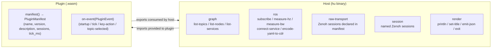
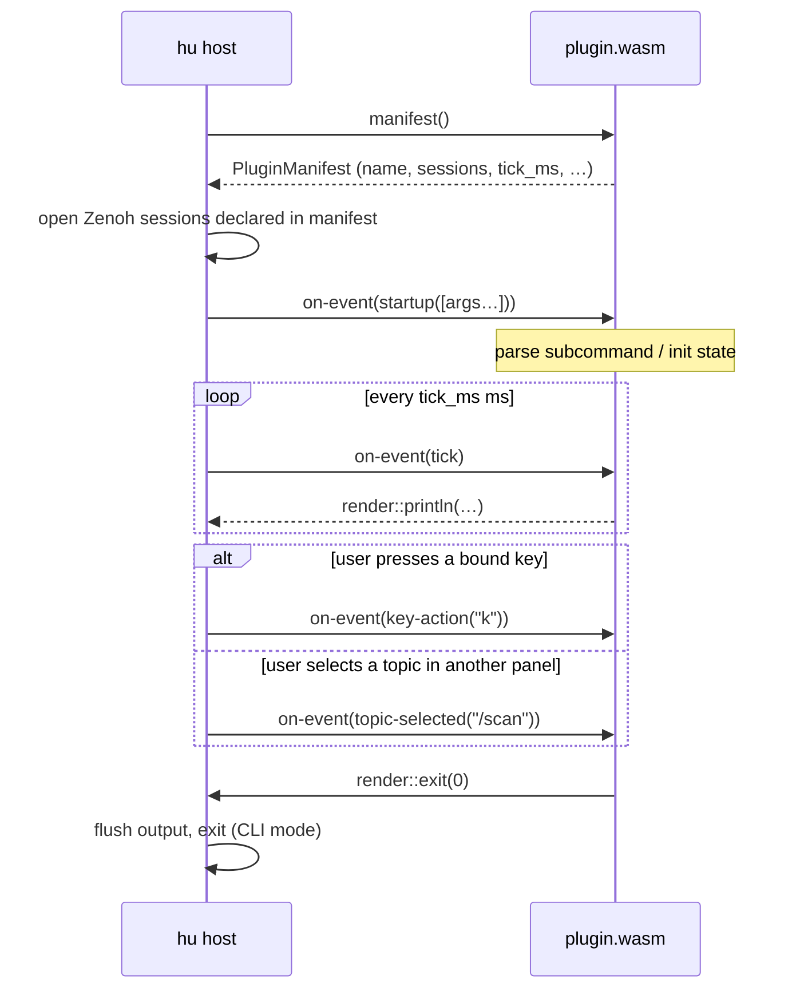

# hu Plugin Authoring Guide

`hu` supports third-party WASM plugins that run sandboxed inside the TUI's Plugins panel (panel 5) or as CLI commands (`hu <plugin-name> <args>`). Plugins are compiled to WebAssembly and loaded at startup from `HU_PLUGIN_PATH` or `~/.local/share/hu/plugins/`.

## Quick start

A plugin is a Rust `cdylib` crate that implements the `hu-plugin` WIT world using `wit_bindgen`.

### 1. Create the crate

```sh
cargo new --lib my-hu-plugin
cd my-hu-plugin
```

Set the crate type in `Cargo.toml`:

```toml
[lib]
crate-type = ["cdylib"]

[dependencies]
wit-bindgen = "0.46"
```

### 2. Copy the WIT schema

Copy `hu-plugin.wit` from `crates/hiroz-union/wit/` into your crate's `wit/` directory. This file defines the stable ABI — do not modify it.

### 3. Implement the world

```rust
wit_bindgen::generate!({
    world: "hu-plugin",
    path: "wit/hu-plugin.wit",
});

use hu::plugin::types::{EventKind, Permission};
use hu::plugin::render;

struct MyPlugin;

impl Guest for MyPlugin {
    fn manifest() -> PluginManifest {
        PluginManifest {
            name: "my-plugin".to_string(),
            version: "0.1.0".to_string(),
            description: "My first hu plugin".to_string(),
            bindings: vec![],
            tick_ms: 1000,
            sessions: vec![],
            subscribed_events: vec![EventKind::Startup, EventKind::Tick],
            required_permissions: vec![],
        }
    }

    fn on_event(event: PluginEvent) {
        match event {
            PluginEvent::Startup(args) => {
                // args is the CLI argument list after the plugin name.
                // e.g. `hu my-plugin foo bar` → args = ["foo", "bar"]
                let _ = args;
            }
            PluginEvent::Tick => {
                render::println("hello from WASM!");
            }
            _ => {}
        }
    }
}

export!(MyPlugin);
```

### 4. Build

Build for the WASI Preview 2 target with plain `cargo build` (no `cargo-component` needed):

```sh
cargo build --target wasm32-wasip2 --release
```

### 5. Install

Name the file `<subcommand>.wasm` — `hu` strips any `hu-` prefix when discovering plugins, so `hu-meter.wasm` registers as `meter` and is invoked by `hu meter <args>`.

```sh
mkdir -p ~/.local/share/hu/plugins
cp target/wasm32-wasip2/release/my_hu_plugin.wasm \
   ~/.local/share/hu/plugins/my-plugin.wasm
```

Start `hu` and press `5` to open the Plugins panel, or run `hu my-plugin <args>` from the terminal.

## WIT world boundary

The `hu-plugin` WIT world defines a strict boundary between what the host provides and what the plugin must export.



## WIT interfaces

### `graph` — ROS graph queries

| Function | Returns |
|---|---|
| `list-topics()` | `list<topic-info>` — name, type-name, publisher/subscriber counts |
| `list-nodes()` | `list<node-info>` — namespace and name |
| `list-services()` | `list<service-info>` — name, type-name, server count |

### `ros` — subscriptions and measurement

| Function | Description |
|---|---|
| `subscribe(topic)` | Returns a `subscription` resource; call `try-recv()` for the next JSON message |
| `measure-hz(topic, window-ms)` | Estimate publish rate (Hz) over the given window |
| `measure-bw(topic, window-ms)` | Estimate bandwidth (KB/s) over the given window |
| `connect-service(name, type)` | Returns a `service-client` resource; call `call(request-json, timeout-ms)` |
| `encode-yaml-to-cdr(yaml, type-name)` | Encode a YAML string to CDR bytes for the given ROS type |

Messages are delivered as JSON strings. CDR decoding is handled by the host; plugins never see raw bytes.

### `render` — output

| Function | Description |
|---|---|
| `println(text)` | Append a line to the plugin's output buffer (shown in the right pane) |
| `set-title(title)` | Update the panel title |
| `emit-json(key, value)` | Shorthand for `println({"key":value})` |
| `exit(code)` | Signal the host to flush output and exit with the given code (CLI mode only) |

The output buffer is a ring-buffer of 1000 lines. Old lines are discarded automatically.

## Events

```wit
variant plugin-event {
    startup(list<string>),   // fired once on load with CLI args (after plugin name)
    key-action(string),      // user pressed a key bound in the manifest
    topic-selected(string),  // user pressed Enter on a topic in another panel
    tick,                    // fired every tick-ms milliseconds
}
```



`startup` is always the first event. In CLI mode (`hu <name> <args>`) use it to parse your subcommand and arguments. Call `render::exit(code)` when done; the host will flush output and exit. Set `tick_ms` in your manifest to control how often `Tick` fires. Use `0` to disable ticks entirely (useful for one-shot CLI commands that exit in `startup`).

## Security note

Plugins can read environment variables from the `hu` process (including `HU_ROUTER`, `HU_DOMAIN`, and any other vars set in the shell). Filesystem and network access are not available. Only install plugins you trust.

## Plugin discovery

```mermaid
flowchart TD
    A["$HU_PLUGIN_PATH dirs\n(colon-separated)"] --> S
    B["~/.local/share/hu/plugins/"] --> S
    S["scan for *.wasm files"] --> C["call manifest() on each candidate"]
    C --> D{manifest() succeeded?}
    D -->|yes| E["strip hu- prefix from filename\nregister as subcommand"]
    D -->|no| F["log warning, skip\n(visible in hu plugin list)"]
```

`hu` searches both locations in order. Files named `hu-<name>.wasm` are registered as `<name>` (the `hu-` prefix is stripped). Run `hu plugin list` to see which plugins loaded successfully.

## Reference implementations

See `crates/hiroz-union/plugins/hu-meter/` and `crates/hiroz-union/plugins/hu-monitor/` for complete examples that implement full CLI subcommand dispatch via the `startup` event.
