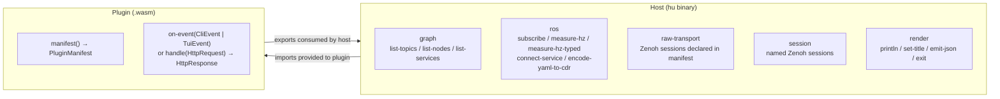
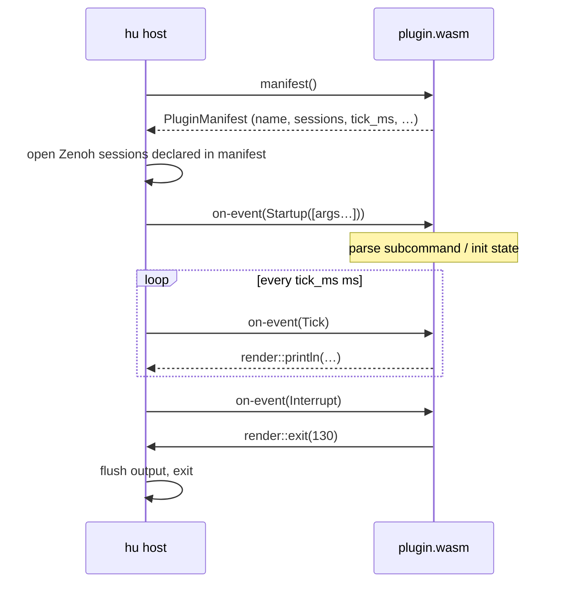
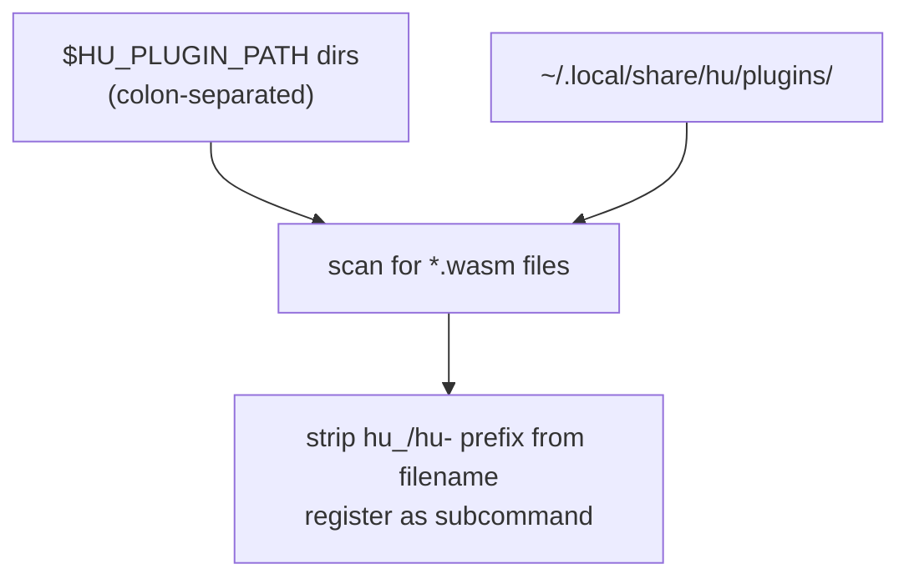

# hu Plugin Authoring Guide

`hu` supports third-party plugins compiled to [WebAssembly System Interface (WASI) Preview 2](https://github.com/WebAssembly/WASI) — a sandboxed, portable binary format. Plugins run as CLI commands (`hu <plugin-name> <args>`), as TUI panes (panel 5), or as web handlers (`hu web`). They are loaded at startup from `$HU_PLUGIN_PATH` or `~/.local/share/hu/plugins/`.

The plugin interface is defined using [WIT (WebAssembly Interface Types)](https://component-model.bytecodealliance.org/design/wit.html) — a typed IDL for describing host/guest contracts. You do not need to understand WIT deeply to write a plugin; `wit_bindgen` generates all the Rust boilerplate from it.

## Prerequisites

- Rust toolchain with the `wasm32-wasip2` target: `rustup target add wasm32-wasip2`
- `hu` built with the `wasm-plugins` feature (the default release binary includes it)

If `hu` was not built with `wasm-plugins`, plugin loading is disabled: `hu plugin list` prints a message saying WASM plugin support isn't compiled in (or `[]` under `--json`).

## Worlds

There are three WIT worlds — pick the one that matches your plugin's role:

| World | Use case | Event type | Status |
|---|---|---|---|
| `hu-cli-plugin` | One-shot or streaming terminal tool (hz, bw, echo) | `cli-event` — startup, tick, interrupt | ✅ shipped (`meter`, `monitor`) |
| `hu-web-plugin` | HTTP request/response handler for `hu web` | no events — stateless `handle(req) → response` | 🟡 landing soon — host fully wired, no reference plugin yet |
| `hu-tui-plugin` | Tick-driven TUI pane with keybindings and topic navigation | `tui-event` — startup, tick, interrupt, key-action, topic-selected | 🟡 landing soon — host fully wired; no reference plugin yet |

Only the CLI world ships with a reference implementation today. The web and TUI worlds are fully defined and the host can load and drive them, but no example plugin ships yet — hence "landing soon". For the TUI world every `tui-event` is now delivered: `startup` fires once on load, `tick` runs automatically each frame (~20 Hz), a focused pane receives `key-action` keystrokes, and `topic-selected` follows Topics-panel navigation. All that's missing is a reference plugin to copy from.

The `hu-plugin` world still exists as a compatibility alias for `hu-tui-plugin`. New plugins should use one of the three typed worlds above.

## Quick start (CLI plugin)

A plugin is a Rust `cdylib` crate that implements a WIT world using `wit_bindgen`.

### 1. Create the crate

```sh
cargo new --lib my-hu-plugin
cd my-hu-plugin
```

Set the crate type in `Cargo.toml`:

```toml
[lib]
crate-type = ["cdylib"]

[dependencies]
wit-bindgen = "0.46"
```

### 2. Copy the WIT schema

Copy `hu-plugin.wit` from `crates/hiroz-union/wit/v0.1/` into your crate's `wit/` directory. The file declares package `hu:plugin@0.1.0` — do not modify it.

### 3. Implement the world

```rust
wit_bindgen::generate!({
    world: "hu-cli-plugin",
    path: "wit/hu-plugin.wit",
});

use hu::plugin::types::{EventKind, Permission};
use hu::plugin::render;

struct MyPlugin;

impl Guest for MyPlugin {
    fn manifest() -> PluginManifest {
        PluginManifest {
            name: "my-plugin".to_string(),
            version: "0.1.0".to_string(),
            description: "My first hu plugin".to_string(),
            bindings: vec![],
            tick_ms: 1000,
            sessions: vec![],
            subscribed_events: vec![EventKind::Startup, EventKind::Tick],
            required_permissions: vec![],
        }
    }

    fn on_event(event: CliEvent) {
        match event {
            CliEvent::Startup(args) => {
                // args is the CLI argument list after the plugin name.
                // e.g. `hu my-plugin foo bar` → args = ["foo", "bar"]
                let _ = args;
            }
            CliEvent::Tick => {
                render::println("hello from WASM!");
            }
            CliEvent::Interrupt => {
                render::exit(130);
            }
        }
    }
}

export!(MyPlugin);
```

`CliEvent` has exactly three arms: `Startup`, `Tick`, and `Interrupt`. There are no dead arms for TUI-only events — the type system enforces the CLI/TUI boundary at compile time.

### 4. Build

Build for the WASI Preview 2 target:

```sh
cargo build --target wasm32-wasip2 --release
```

No `cargo-component` or other tooling required — plain `cargo build` with the `wasm32-wasip2` target is sufficient.

### 5. Install

Name the file `<subcommand>.wasm` — `hu` strips any `hu-` prefix when discovering plugins, so `hu-meter.wasm` registers as `meter` and is invoked by `hu meter <args>`.

```sh
mkdir -p ~/.local/share/hu/plugins
cp target/wasm32-wasip2/release/my_hu_plugin.wasm \
   ~/.local/share/hu/plugins/my-plugin.wasm
```

Start `hu` and press `5` to open the Plugins panel (TUI plugins), or run `hu my-plugin <args>` from the terminal (CLI plugins).

### 6. Run it end-to-end

The shipped template (`crates/hiroz-union/plugins/hu-plugin-template/`) is exactly the crate above. Build it, point `HU_PLUGIN_PATH` at the output, and invoke it by its manifest name (`my-plugin`). Its `on_event` handler stores the `Startup` args and prints `hello from WASM!` on every `Tick` (`tick_ms = 1000`), so a running session emits one line per second until interrupted:

```sh
cargo build --target wasm32-wasip2 --release \
  --manifest-path crates/hiroz-union/plugins/hu-plugin-template/Cargo.toml

export HU_PLUGIN_PATH=target/wasm32-wasip2/release
hu my-plugin demo-arg
# hello from WASM!
# hello from WASM!
# ^C
```

This is the same path the integration suite drives in `test_hu_plugin_template_runtime_ticks` (`crates/hiroz-tests/tests/hu_meter.rs`), which runs `hu my-plugin`, lets the Tick loop fire, and asserts the `hello from WASM!` output — so the template's demonstrated example logic is verified at runtime, not just that the component loads.

## WIT world boundary


```mermaid
flowchart LR
    subgraph Host["Host (hu binary)"]
        G["graph<br>list-topics / list-nodes / list-services"]
        R["ros<br>subscribe / measure-hz / measure-hz-typed<br>connect-service / encode-yaml-to-cdr"]
        RT["raw-transport<br>Zenoh sessions declared in manifest"]
        S["session<br>named Zenoh sessions"]
        Ren["render<br>println / set-title / emit-json / exit"]
    end
    subgraph Plugin["Plugin (.wasm)"]
        MF["manifest() → PluginManifest"]
        OE["on-event(CliEvent | TuiEvent)<br>or handle(HttpRequest) → HttpResponse"]
    end
    Host -->|imports provided to plugin| Plugin
    Plugin -->|exports consumed by host| Host
```

## WIT interfaces

### `graph` — ROS graph queries

| Function | Returns |
|---|---|
| `list-topics()` | `list<topic-info>` — name, type-name, publisher/subscriber counts |
| `list-nodes()` | `list<node-info>` — namespace and name |
| `list-services()` | `list<service-info>` — name, type-name, server count |

### `ros` — subscriptions and measurement

| Function | Description |
|---|---|
| `subscribe(topic)` | Returns a `subscription` resource; call `try-recv()` for the next JSON message |
| `measure-hz(topic, window-ms)` | Estimate publish rate (Hz) as a scalar `f64` |
| `measure-hz-typed(topic, window-ms)` | Returns `hz-measurement { topic, rate-hz, sample-count }` |
| `measure-bw(topic, window-ms)` | Estimate bandwidth (KB/s) as a scalar `f64` |
| `measure-bw-typed(topic, window-ms)` | Returns `bw-measurement { topic, rate-kbps, sample-count }` |
| `connect-service(name, type)` | Returns a `service-client` resource; call `call(request-json, timeout-ms)` |
| `encode-yaml-to-cdr(yaml, type-name)` | Encode a YAML string to CDR bytes for the given ROS type |

Prefer the `*-typed` variants for new plugins — they carry topic name and sample count alongside the measurement and avoid a JSON round-trip.

Messages delivered by `subscribe` are JSON strings. CDR decoding is handled by the host; plugins never see raw bytes unless they use `raw-transport` directly.

### `render` — output

| Function | Description |
|---|---|
| `println(text)` | Append a line to the plugin's output buffer |
| `set-title(title)` | Update the panel title (TUI mode) |
| `emit-json(key, value)` | Shorthand for `println({"key":value})` |
| `exit(code)` | Signal the host to flush output and exit with the given code (CLI mode only) |

The output buffer is a ring-buffer of 1000 lines. Old lines are discarded automatically.

### `raw-transport` — low-level Zenoh access

`raw-transport` gives plugins direct access to Zenoh primitives over the shared host session. Use it when `ros` interface abstractions are too high-level — for example, when you need to inspect raw CDR bytes, match custom key expressions, or implement a bridge that rewrites key expressions between sessions.

| Resource | Methods | Description |
|---|---|---|
| `raw-subscription` | `try-recv() → option<list<u8>>` | Non-blocking receive of the next raw CDR payload |
| `raw-publisher` | `publish(payload: list<u8>)` | Publish raw bytes on a Zenoh key expression |
| `liveliness-token` | (drop to undeclare) | Declare a liveliness token on a key expression |
| `liveliness-sub` | `try-recv() → option<tuple<string, bool>>` | Non-blocking poll for liveliness events — `(key, appeared)` |
| `queryable` | `try-recv-query() → option<query>`, `reply(query, payload)` | Expose a Zenoh queryable (for service-server-like patterns) |
| `querier` | `call(payload) → result<list<u8>, string>` | Synchronous Zenoh get (for service-client-like patterns) |

All resources are declared by calling the corresponding host function: `raw-subscribe(ke)`, `raw-publisher(ke)`, `declare-liveliness(ke)`, `subscribe-liveliness(ke)`, `declare-queryable(ke)`, `querier(ke)`.

### `session` — named Zenoh sessions

For bridge plugins and other low-level use: declare sessions in your manifest and retrieve them via `session::get-session(name)`. The returned `session-handle` exposes the same raw subscribe, publish, liveliness, queryable, and querier primitives as `raw-transport`, but on a separately opened session — useful when a plugin needs two independent Zenoh connections (e.g. Humble and Jazzy router endpoints).

### `permission` — host-call gating

Every plugin declares the host capabilities it needs in `required_permissions` (a `list<permission>` on `PluginManifest`). The host records the granted set before the first event and rejects any host call whose required permission was not declared — the call returns an error to the guest rather than silently succeeding. A plugin with an empty `required_permissions` can still render output and receive events, but every graph-mutating or transport host call below will fail.

| Permission | Gates |
|---|---|
| `subscribe-topic` | `ros::subscribe(topic)` |
| `publish-topic` | `ros::publish(...)` (typed publish / `encode-yaml-to-cdr` publish path) |
| `call-service` | `ros::connect-service(name, type)` and the resulting `service-client::call` |
| `measure-metrics` | `ros::measure-hz`, `measure-hz-typed`, `measure-bw`, `measure-bw-typed` |
| `access-raw-cdr` | all `raw-transport` host calls — `raw-subscribe`, `raw-publisher`, `declare-liveliness`, `subscribe-liveliness`, `declare-queryable`, `querier` |
| `open-session` | `session::get-session(name)` (named multi-session access) |

`hu-meter`'s `echo <topic> --raw` mode reads raw CDR payloads through `raw-transport`, so it declares `access-raw-cdr` in its manifest.

## Events

### CLI events (`hu-cli-plugin`)

```wit
variant cli-event {
    startup(list<string>),   // fired once on load with CLI args after the plugin name
    tick,                    // fired every tick-ms milliseconds
    interrupt,               // user pressed Ctrl-C
}
```

### TUI events (`hu-tui-plugin`)

```wit
variant tui-event {
    startup(list<string>),
    key-action(string),      // user pressed a key declared in the manifest
    topic-selected(string),  // user pressed Enter on a topic in another panel
    tick,
    interrupt,
}
```

## Event lifecycle


```mermaid
sequenceDiagram
    participant Host as hu host
    participant Plugin as plugin.wasm

    Host->>Plugin: manifest()
    Plugin-->>Host: PluginManifest (name, sessions, tick_ms, …)
    Host->>Host: open Zenoh sessions declared in manifest
    Host->>Plugin: on-event(Startup([args…]))
    Note over Plugin: parse subcommand / init state

    loop every tick_ms ms
        Host->>Plugin: on-event(Tick)
        Plugin-->>Host: render::println(…)
    end

    Host->>Plugin: on-event(Interrupt)
    Plugin->>Host: render::exit(130)
    Host->>Host: flush output, exit
```

`Startup` is always the first event. In CLI mode parse your subcommand and arguments there. Call `render::exit(code)` when done; the host flushes output and exits. Set `tick_ms` to `0` to disable ticks (useful for one-shot commands that finish in `Startup`).

## Plugin discovery


```mermaid
flowchart TD
    A["$HU_PLUGIN_PATH dirs<br>(colon-separated)"] --> S
    B["~/.local/share/hu/plugins/"] --> S
    S["scan for *.wasm files"] --> E["strip hu_/hu- prefix from filename<br>register as subcommand"]
```

`hu` searches both locations in order for `*.wasm` files. Discovery is a pure filename scan: the name is derived from the filename (stripping a leading `hu_` or `hu-`), and the component is **not** instantiated and its `manifest()` is **not** called at this stage. Files named `hu-<name>.wasm` (or `hu_<name>.wasm`) register as `<name>`. Run `hu plugin list` to see the discovered plugins and their paths.

Because discovery never loads the component, `hu plugin list` cannot distinguish a valid plugin from a corrupt or ABI-mismatched one — there is no `failed` status. A plugin's manifest and ABI are only validated lazily, when you actually invoke its subcommand; a mismatch or missing export surfaces as an error at that point, not at `plugin list` time. Use `hu plugin validate <path>` to check a specific artifact ahead of time.

## Multi-session plugins (`session` interface)

A plugin that needs two independent Zenoh connections — for example, one that forwards messages between two routers (Humble on port 7447 and Jazzy on port 7448) — declares both sessions in its manifest via `SessionRequirement { name, endpoint, mode }`. The host opens all declared sessions before the first `Startup` event, and the plugin retrieves each one with `session::get_session(name)`, which returns a `session-handle` exposing `raw-subscribe`, `raw-publisher`, `declare-liveliness`, `subscribe-liveliness`, and `declare-queryable` — the same primitives as `raw-transport`, but scoped to that named session rather than the shared host session.

No such bridge plugin ships in this PR. For worked, compiling examples of manifest declaration, session/state handling, and event dispatch, see the reference implementations below — `hu-meter` in particular declares and drives a session end-to-end.

## Environment

Plugins can read environment variables from the `hu` process (`HU_CONNECT`, `HU_DOMAIN`, and any others set in the shell). Filesystem and network access are not available. Only install plugins you trust.

## Reference implementations

See `crates/hiroz-union/plugins/hu-plugin-template/` for the minimal runnable version of the quick-start example above. CI builds it against the `wasm32-wasip2` target and then loads the compiled artifact through the real component-model host — `scripts/ci/hu-tests.sh` runs `hu plugin validate` and `hu plugin list` on it (see `test_hu_plugin_template_validate_and_discover` in `crates/hiroz-tests/tests/hu_meter.rs`). So the template is verified to load against the live WIT world, not merely to compile, and a WIT/ABI regression fails CI. `crates/hiroz-union/plugins/hu-meter/` and `crates/hiroz-union/plugins/hu-monitor/` are full CLI plugins with subcommand dispatch and periodic output.
