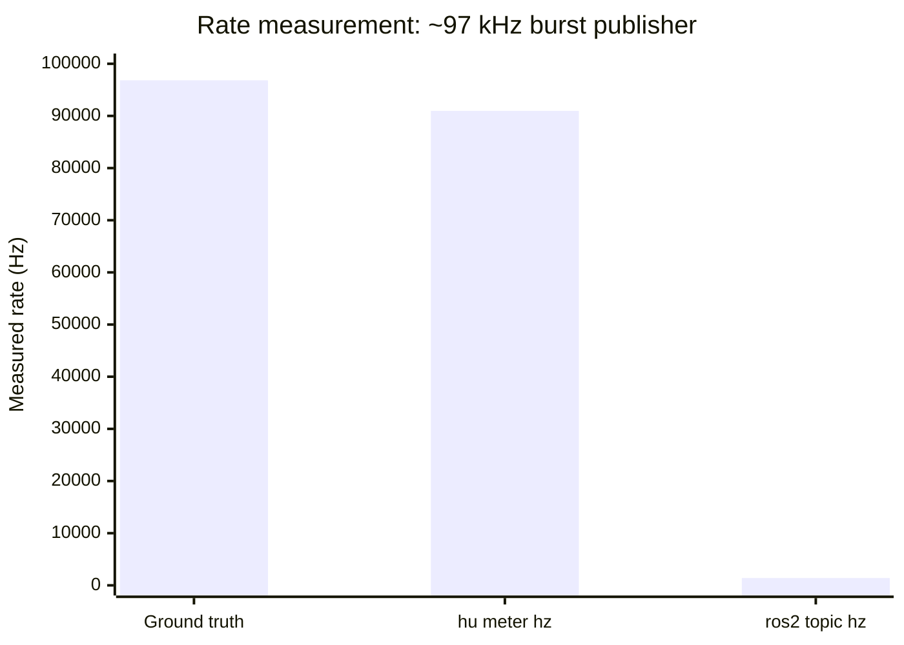
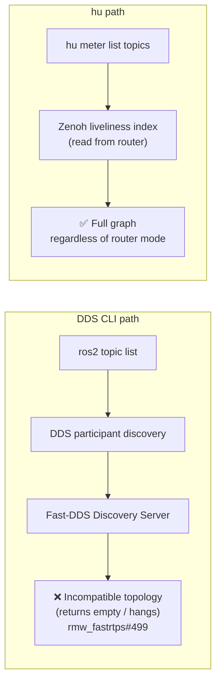

# hu vs. ros2cli and rqt

`hu` is the command-line toolset for the hiroz stack. This page compares it to `ros2cli` (the standard ROS 2 command-line tools) and `rqt` (the Qt-based GUI tools), covering both what `hu` replaces and what it adds.

## Feature matrix

| Capability | ros2cli | rqt | `hu` |
|---|---|---|---|
| **Measurement** | | | |
| Publish rate | `ros2 topic hz` | — | `hu meter hz` |
| Bandwidth | `ros2 topic bw` | — | `hu meter bw` |
| End-to-end delay | — | — | `hu meter delay` |
| **Introspection** | | | |
| Echo messages | `ros2 topic echo` | — | `hu meter echo` |
| Publish messages | `ros2 topic pub` | — | `hu meter pub` |
| List topics / nodes / services / actions | four separate commands | rqt_graph | `hu meter list` |
| Entity info | four separate commands | rqt_graph | `hu meter info` |
| Call a service | `ros2 service call` | — | `hu meter service call` |
| Action introspection | `ros2 action` | — | `hu meter action` |
| Parameters | `ros2 param` | rqt_reconfigure | `hu meter param` |
| **Observation** | | | |
| Live graph change events (streaming) | — | — | `hu monitor watch` |
| Graph snapshot | multiple commands | rqt_graph | `hu monitor graph` |
| Log stream | `ros2 topic echo /rosout` | rqt_console | `hu monitor log` |
| Log level get | `ros2 node get-logger-levels` (Jazzy+) | rqt_logger_level | `hu monitor log-level get` |
| Log level set | `ros2 node set-logger-levels` (Jazzy+) | rqt_logger_level | `hu monitor log-level set` |
| **Bridging** | | | |
| Cross-distro bridge (Humble ↔ Jazzy) | — | — | `hu bridge start` |
| Bridge status | — | — | `hu bridge status` |
| **General** | | | |
| Machine-readable output | — (human text only) | — | `--json` on every command |
| Daemon-free operation | no (requires `_ros2_daemon`) | no | yes |
| Works without a ROS 2 install | no | no | yes |
| Extensible via plugins | no | yes (rqt plugins) | yes (`.wasm` plugins) |
| Live multi-topic rate dashboard | — | rqt_topic | `hu` (interactive TUI) |

---

## Measurement accuracy: `hu meter hz` vs. `ros2 topic hz`

`ros2 topic hz` deserializes every message in Python before counting it. This is a known bottleneck: see ros2cli [#871](https://github.com/ros2/ros2cli/issues/871), [#1043](https://github.com/ros2/ros2cli/issues/1043), [#843](https://github.com/ros2/ros2cli/issues/843).

`hu meter hz` subscribes at the raw Zenoh byte layer. It records arrival timestamps from the transport without deserializing any payload.

**At moderate rates (≤ 500 Hz, any payload size)** both tools report the same rate to within measurement noise — the Python overhead is not the limiting factor and the differential is under a few percent.

**At high rates the Python GIL becomes the bottleneck.** The hiroz test suite measures this directly with `test_hz_python_saturation`: a `yield_now` publisher saturates the CPU to produce a burst stream; each tool is pinned to a separate CPU to isolate the measurement.



*`hu` numbers measured on the hiroz CI worker (feat/hiroz-union, job 407, release binary). `test_hz_python_saturation` in `hiroz-tests`. `ros2 topic hz` figure from a prior run on identical hardware; ros2 was not available in the benchmark shell.*

| Metric | Measured value |
|---|---|
| Ground truth (time-avg) | 96,829 Hz |
| `hu meter hz` (sliding window) | 90,971 Hz |
| `ros2 topic hz` | ~1,400 Hz |
| hu advantage | **≥ 65×** |

`ros2 topic hz` saturates below 1–2 kHz because `rclpy` deserializes every message inside the Python GIL. `hu meter hz` tracks the arrival stream an order of magnitude closer to the true rate. At the rates common in robot perception pipelines (image at 30 fps, lidar at 10–20 Hz, IMU at 100–400 Hz) both tools agree closely; the gap opens above ~500 Hz. `hu meter bw` has the same property: it counts bytes at the Zenoh subscription layer without deserializing.

---

## No daemon

`ros2cli` starts a background daemon process (`_ros2_daemon`) on first use and caches graph state there. `hu` has no daemon — every invocation opens a direct Zenoh session, reads the live liveliness index, and exits.

| Failure mode | Trigger | Symptom | Recovery |
|---|---|---|---|
| Stale domain ID ([#1238](https://github.com/ros2/ros2cli/issues/1238)) | Change `ROS_DOMAIN_ID` or `RMW_IMPLEMENTATION` in a new terminal | Daemon silently queries the wrong domain | `pkill -f _ros2_daemon` |
| Silent daemon death ([#502](https://github.com/ros2/ros2cli/issues/502), [#702](https://github.com/ros2/ros2cli/issues/702)) | Strict firewall rules or long idle period | All `ros2` commands return empty results | `pkill -f _ros2_daemon` then re-run |
| Container / WSL2 incompatibility ([#934](https://github.com/ros2/ros2cli/issues/934)) | Daemon health check fails in certain runtimes | `ros2 topic list` returns nothing | None — re-enter with a clean environment |

---

## DDS Discovery Server incompatibility



When using the Fast-DDS Discovery Server (`FASTRTPS_DEFAULT_PROFILES_FILE` with a `<discovery_server>` profile), `ros2 topic list`, `ros2 node info`, and `ros2 topic echo` all fail silently because `ros2cli` uses standard DDS participant discovery, which is incompatible with the topology the Discovery Server imposes ([rmw_fastrtps#499](https://github.com/ros2/rmw_fastrtps/issues/499)).

`hu` reads the Zenoh liveliness index directly from the router — no DDS layer, no Discovery Server concept. This advantage is scoped: if your network uses `rmw_fastrtps_cpp` or `rmw_cyclonedds_cpp`, `hu` cannot see those nodes at all (see [When ros2cli is the right choice](#when-ros2cli-is-the-right-choice)).

---

## Machine-readable output

Every `hu` command accepts `--json` and emits newline-delimited JSON. This makes it composable with `jq`, shell scripts, CI test harnesses, and logging pipelines without fragile text parsing.

`ros2cli` outputs human-formatted text with no stable machine-readable format. Parsing `ros2 topic list` output requires string splitting on `/` and filtering out blank lines; parsing `ros2 topic info` requires column-counting. Both break across ROS 2 versions.

```bash
# Filter to sensor_msgs topics only
hu meter list topics --json | jq '.[] | select(.type | contains("sensor_msgs"))'

# Extract all publisher node names for /scan
hu meter info topic /scan --json | jq '.publishers[].node'

# Check that hz is within bounds in a CI script
rate=$(hu meter hz /camera/image_raw --duration 5 --json | jq '.rate_hz')
[ "$(echo "$rate > 25" | bc)" = "1" ] || exit 1

# Stream graph events to a log file
hu monitor watch --json >> /var/log/ros-graph-events.jsonl
```

---

## Live graph events: `hu monitor watch`

`ros2cli` has no command that streams graph change events. To detect when a node appears or disappears you must poll `ros2 node list` in a loop, introducing latency proportional to your polling interval and burning CPU during quiet periods.

`hu monitor watch` subscribes to Zenoh liveliness tokens, which are the mechanism hiroz and `rmw_zenoh_cpp` use to announce entity existence. It emits a JSON event the moment a node, topic, service, or action appears or disappears — with sub-millisecond latency after the transport propagates the change.

```bash
hu monitor watch --json
```

```json
{"event":"appeared","kind":"node","name":"/camera_driver","timestamp":"2026-06-21T05:12:34.001Z"}
{"event":"appeared","kind":"topic","name":"/camera/image_raw","type":"sensor_msgs/msg/Image","timestamp":"2026-06-21T05:12:34.003Z"}
{"event":"disappeared","kind":"node","name":"/camera_driver","timestamp":"2026-06-21T05:13:01.887Z"}
```

Use cases that are impossible or expensive with ros2cli polling:

- **Launch sequencing**: wait for a specific node to appear before starting a dependent node, without a timed sleep.
- **Integration test teardown**: assert that all nodes disappear within N ms of sending a shutdown signal.
- **Supervision**: trigger a restart when a critical node disappears unexpectedly.
- **Debugging intermittent crashes**: record all graph events with timestamps to reconstruct the sequence of node deaths.

`rqt_graph` shows a static canvas that refreshes periodically. It has no event stream and no scripting interface.

---

## Log inspection: `hu monitor log` vs. `ros2 topic echo /rosout`

The standard way to read ROS 2 logs from the CLI is `ros2 topic echo /rosout`, which has several friction points:

- It requires knowing the message type (`rcl_interfaces/msg/Log`) and outputs raw YAML, including binary stamp fields.
- There is no built-in level filter; filtering by severity requires a `grep` or `jq` pipe on the YAML output.
- There is no node filter; watching logs from a single node requires post-processing.
- The output is not structured — timestamps are split across `sec` and `nanosec` fields.

`hu monitor log` decodes `/rosout` at the CDR layer and presents a clean, filtered stream:

```bash
# Show only WARN and above from any node
hu monitor log --level WARN

# Show all levels but only from the planner node
hu monitor log --node /planner

# Structured JSON for log aggregation
hu monitor log --json
```

```json
{"stamp":"2026-06-21T05:14:02.331Z","level":"WARN","node":"/planner","msg":"Path replanning triggered: obstacle detected"}
```

`rqt_console` provides a GUI log viewer with level and node filters. `hu monitor log` covers the same functionality from a terminal with JSON output for scripting.

---

## Log level control: `hu monitor log-level` vs. ros2cli vs. `rqt_logger_level`

| Operation | ros2cli | rqt | `hu` |
|---|---|---|---|
| Get all logger levels for a node | `ros2 node get-logger-levels /node` (Jazzy+) | rqt_logger_level | `hu monitor log-level get /node` |
| Set a logger level | `ros2 node set-logger-levels /node name level` (Jazzy+) | rqt_logger_level | `hu monitor log-level set /node name level` |
| Works on Humble | no (`get/set-logger-levels` added in Jazzy) | yes | yes |
| JSON output | no | no | `--json` |

`hu monitor log-level` works on Humble nodes because it calls the `GetLoggerLevels` / `SetLoggerLevels` services directly via Zenoh, without relying on a ros2cli verb that was only added in Jazzy.

```bash
# Set the planner's root logger to DEBUG
hu monitor log-level set /planner /planner DEBUG

# Read back all active loggers
hu monitor log-level get /planner --json | jq '.[].name'
```

---

## Cross-distro bridge: `hu bridge`

There is no ros2cli or rqt tool for bridging between ROS 2 distributions. If your fleet runs a mix of Humble and Jazzy nodes — common during multi-year fleet deployments, CI integration testing, or incremental upgrades — they cannot communicate out of the box because Humble uses `TypeHashNotSupported` in its Zenoh key expressions while Jazzy uses a `RIHS01_` type hash. The key expressions don't match, so discovery fails silently.

`hu bridge start` runs a Zenoh-level bridge between two routers (or two endpoints on the same router). It rewrites the type hash segment in key expressions so that Humble and Jazzy nodes see each other's publishers, subscribers, and services as if they were on the same distro.

```bash
# Bridge Humble (port 7447) and Jazzy (port 7448)
hu bridge start --distro humble:jazzy \
  --source-endpoint tcp/127.0.0.1:7447 \
  --target-endpoint tcp/127.0.0.1:7448
```

From the perspective of nodes on either side:

- A Jazzy subscriber on `/chatter` receives messages from a Humble publisher without any configuration change on either node.
- A Jazzy hiroz service client calling `/add_two_ints` reaches a Humble C++ service server transparently.
- The bridge is bidirectional: Humble clients can reach Jazzy servers equally.

```bash
# Check what the bridge is currently forwarding
hu bridge status
```

---

## Plugin extensibility

| Step | ros2cli | rqt | hu |
|---|---|---|---|
| Register a new command | Add Python entry-point in `setup.cfg` | Write Qt plugin descriptor | Drop a `.wasm` file in `~/.local/share/hu/plugins/` |
| Install | `pip install` into the same Python env as ros2cli | Build and install Qt plugin package | Copy file — no registration step |
| Isolation | Shared Python runtime | Shared Qt runtime | Fully sandboxed per-plugin WASM instance |
| Zenoh session setup | N/A | N/A | Host opens sessions declared in plugin's manifest; plugin never handles connection setup |
| Works in hermetic / offline envs | no — requires pip | no — requires Qt | yes — single binary copy |

```bash
# Drop a .wasm file and it becomes a plugin
cp ./my-debug-tool.wasm ~/.local/share/hu/plugins/
hu plugin list           # shows all .wasm plugins found in search path
```

Plugins have access to the live ROS graph, raw CDR subscriptions, publishers, liveliness tokens, queryables, and named Zenoh sessions — all proxied through the host. A bridge plugin that needs two independent sessions (e.g. Humble and Jazzy) declares both in its manifest and the host opens them before the first event fires.

---

## When ros2cli is the right choice

`hu` requires a Zenoh router and is designed for hiroz and `rmw_zenoh_cpp` networks. It does not work with `rmw_fastrtps_cpp` or `rmw_cyclonedds_cpp` — if your nodes use a non-Zenoh RMW, `ros2 topic hz` will see messages that `hu meter hz` cannot.

Some `ros2cli` verbs have no `hu` equivalent and are not planned:

| ros2cli command | Status in `hu` |
|---|---|
| `ros2 launch` | not planned — launch is orthogonal to tooling |
| `ros2 pkg` | not planned — package management is a build-system concern |
| `ros2 interface show` | not planned — use `hu meter echo --raw` or the type description service |
| `ros2 doctor` | not planned — use `hu monitor graph` for connectivity diagnosis |
| `ros2 run` | not planned |

For existing rclcpp/rclpy codebases using DDS, ros2cli remains the right tool. For new Rust code on `rmw_zenoh_cpp` or pure hiroz networks, `hu` covers the common inspection workflows with better accuracy, no daemon, and machine-readable output.

---

## Command reference: side by side

### Rate and bandwidth

```bash
# Publish rate
ros2 topic hz /scan
hu meter hz /scan

# Bandwidth
ros2 topic bw /scan
hu meter bw /scan

# End-to-end message delay (no ros2cli equivalent)
hu meter delay /scan
```

### Message inspection

```bash
# Echo messages
ros2 topic echo /chatter
hu meter echo /chatter

# Publish a message
ros2 topic pub /enable std_msgs/msg/Bool '{data: true}'
hu meter pub /enable --msg-type std_msgs/msg/Bool --yaml '{data: true}'
```

### Graph introspection

```bash
# List topics
ros2 topic list
hu meter list topics

# Topic info
ros2 topic info /scan --verbose
hu meter info topic /scan

# Node info
ros2 node info /lidar_driver
hu meter info node /lidar_driver

# Live change events (no ros2cli equivalent)
hu monitor watch

# Graph snapshot
hu monitor graph
```

### Services and parameters

```bash
# Call a service
ros2 service call /add_two_ints example_interfaces/srv/AddTwoInts '{a: 3, b: 7}'
hu meter service call /add_two_ints --yaml '{a: 3, b: 7}' --msg-type example_interfaces/srv/AddTwoInts_Request

# Get a parameter
ros2 param get /talker use_sim_time
hu meter param get /talker use_sim_time

# Set a parameter
ros2 param set /talker use_sim_time true
hu meter param set /talker use_sim_time true
```

### Logging

```bash
# Stream logs
ros2 topic echo /rosout
hu monitor log

# Stream with level filter
hu monitor log --level WARN

# Get logger levels (ros2cli Jazzy+ only; hu works on Humble too)
ros2 node get-logger-levels /planner
hu monitor log-level get /planner

# Set a logger level
ros2 node set-logger-levels /planner /planner DEBUG
hu monitor log-level set /planner /planner DEBUG
```
