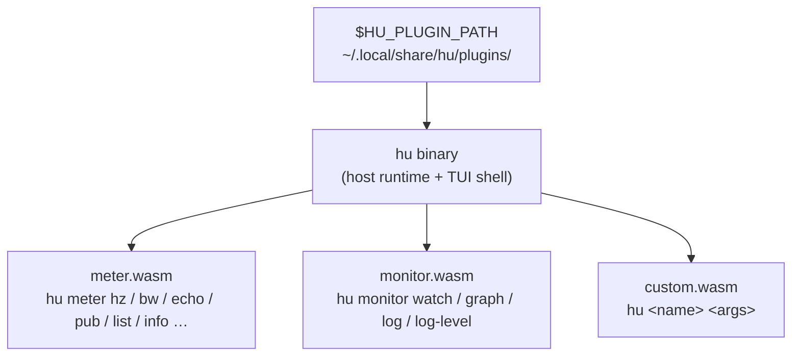

# hu — The hiroz Unified Tool

`hu` is the command-line companion to the hiroz stack. It replaces `ros2 topic`, `ros2 node`, `ros2 service`, `ros2 action`, and `ros2 param` with a daemon-free, plugin-based tool that works directly over Zenoh — no DDS, no Python, no background process. Subcommands like `meter` and `monitor` are WASM plugins; you can ship your own by dropping a `.wasm` file into `~/.local/share/hu/plugins/`.

## Terminology

A few terms recur throughout this page:

- **Zenoh router** — the process (`zenohd`, or `rmw_zenohd` when bundled with `rmw_zenoh_cpp`) that lets `hu` and ROS 2 nodes discover and reach each other; `hu` always connects to one, it never uses peer-to-peer discovery.
- **Domain ID** — a numeric namespace (default `0`) that partitions independent ROS 2 graphs sharing the same router.
- **Liveliness** — Zenoh's mechanism for announcing and detecting when a node, topic, or service appears or disappears, which is how `hu` builds its live graph view without polling.
- **CDR** — Common Data Representation, the binary wire format ROS 2 messages are serialized to; `hu meter` decodes and encodes it directly.
- **RMW** — the ROS Middleware interface; `rmw_zenoh_cpp` is the RMW implementation that lets standard ROS 2 nodes talk over Zenoh, which is what makes them visible to `hu`.

## Installation

### Pre-built Binary

Download the latest release for your platform from the [Releases page](https://github.com/ZettaScaleLabs/hiroz/releases):

| Platform | File |
|---|---|
| Linux x86_64 | `bin-hu-x86_64-linux` |
| Linux aarch64 | `bin-hu-aarch64-linux` |
| macOS aarch64 | `bin-hu-aarch64-macos` |

```bash
# Linux x86_64 example — replace <version> and filename for your platform
curl -Lo hu https://github.com/ZettaScaleLabs/hiroz/releases/download/<version>/bin-hu-x86_64-linux
chmod +x hu
./hu --help
```

`hu` has no ROS 2 dependency — it works with any [`rmw_zenoh_cpp`](https://github.com/ros2/rmw_zenoh) or hiroz deployment.

### Build from Source

Requires Rust 1.85+:

```bash
# Build hu (release build)
cargo build -p hiroz-union --release

# Run directly from build output — produces a binary named `hu`
./target/release/hu --help

# Or install to ~/.cargo/bin so `hu` works from anywhere
cargo install --path crates/hiroz-union
```

## Quick Start

This walks through a real end-to-end session: a router, a talker/listener pair, and `hu` observing them. Run each step in its own terminal.

**Terminal 1 — start the Zenoh router:**

```bash
cargo run --example zenoh_router
```

**Terminal 2 — start a hiroz listener:**

```bash
cargo run --example z_pubsub -- --role listener
```

**Terminal 3 — start a hiroz talker:**

```bash
cargo run --example z_pubsub -- --role talker
```

Both examples connect to `tcp/127.0.0.1:7447` (never bare peer discovery — see [`examples/z_pubsub.rs`](https://github.com/ZettaScaleLabs/hiroz/blob/main/crates/hiroz/examples/z_pubsub.rs)), and publish/subscribe on `/chatter`.

**Terminal 4 — observe with `hu`:**

```bash
# List all topics
hu meter list topics
# /chatter (std_msgs/msg/String)

# Measure the talker's publish rate
hu meter hz /chatter
# rate: 1.001 Hz

# Watch the live graph
hu monitor watch
# node appeared:  /talker
# node appeared:  /listener
# topic appeared: /chatter
```

By default `hu` connects to `tcp/127.0.0.1:7447` and uses domain ID `0` — matching the talker/listener above. Override with flags or environment variables:

```bash
hu --router tcp/192.168.1.10:7447 --domain 5 meter list topics
```

Or set them once for the session:

```bash
export HU_ROUTER=tcp/192.168.1.10:7447
export HU_DOMAIN=5
hu meter hz /chatter
```

---

## Why hu instead of ros2cli?

`ros2cli` carries a set of well-known pain points — a background daemon that goes stale or crashes, Python-bound rate measurement that undercounts at high frequency, silent QoS-mismatch drops, service calls with no timeout, slow startup on embedded hardware, and fragile nested-YAML publishing. `hu` addresses all of these with a daemon-free, compiled, Zenoh-native design.

See [Why hu instead of ros2cli?](why-hu.md) for the full comparison with issue references and before/after examples.

---

## Summary

| Pain point | ros2cli | hu |
|---|---|---|
| Daemon crashes / stale state | ❌ common | ✅ no daemon |
| Rate measurement accuracy | ❌ Python deserialization bottleneck | ✅ raw Zenoh bytes |
| QoS mismatch warning | ❌ silent drop | ✅ explicit warning |
| Service call timeout | ❌ hangs forever | ✅ `--timeout` flag |
| Startup time (embedded HW) | ❌ 7+ seconds | ✅ <10 ms |
| Nested YAML in topic pub | ❌ fails silently | ✅ CDR-aware encoding |
| Works without ROS 2 install | ❌ requires full ROS 2 | ✅ only needs a Zenoh router |

---

## Subcommands

### hu meter

Measurement and introspection:

| Command | Description |
|---|---|
| `hu meter hz <topic>` | Publish rate (sliding window) |
| `hu meter bw <topic>` | Bandwidth in bytes/sec |
| `hu meter echo <topic>` | Print arriving messages |
| `hu meter delay <topic>` | End-to-end latency |
| `hu meter pub <topic>` | Publish a message |
| `hu meter list topics\|nodes\|services` | Enumerate graph entities |
| `hu meter info topic\|node\|service <name>` | Full entity introspection |
| `hu meter service <name> <type> <request-json>` | Call a service |
| `hu meter param list\|get\|set\|delete <node>` | Read/write/delete node parameters |
| `hu meter action send\|echo <name> <type> [<goal-json>]` | Send a goal or echo action feedback |

### hu monitor

Observation and diagnostics:

| Command | Description |
|---|---|
| `hu monitor watch` | Stream live graph change events |
| `hu monitor graph` | Snapshot the current graph (with optional `--watch` refresh) |
| `hu monitor log [--count <n>]` | Tail `/rosout` |
| `hu monitor log-level <node> [<level>]` | Read or change a node's logger level |

### hu plugin

Plugin management:

| Command | Description |
|---|---|
| `hu plugin list` | List all loaded `.wasm` plugins with name and path |
| `hu plugin validate <path>` | Validate a `.wasm` file against the `hu-plugin` ABI |

---

## Multi-topic Rate Dashboard

For continuous monitoring of multiple topics at once, use the `hu` TUI. It shows a live rate table for all active topics, updated every second, without spawning one process per topic:

```bash
hu
```

This is the primary advantage over `ros2 topic hz`, which requires a separate terminal per topic.

### TUI Keybindings

| Key | Action |
|---|---|
| `Tab` / `Shift+Tab` | Cycle panels (Topics, Services, Nodes, Measure, Plugins) |
| `1`–`5` | Jump directly to a panel |
| `↑`/`k`, `↓`/`j` | Move selection |
| `Enter` / `Space` | Expand/focus the selected item's detail |
| `/` | Enter filter mode (type-ahead search) |
| `r` | Quick rate check on the selected topic (Topics panel) or clear tracked rates (Measure panel) |
| `m` | Toggle the selected topic or service into the Measure panel's tracking list |
| `w` | Start/stop recording metrics |
| `e` | Export the current rate cache to a timestamped CSV file |
| `S` | Capture a screenshot of the current TUI state |
| `?` | Toggle the help overlay |
| `q` / `Ctrl+C` | Quit |

---

## JSON Output

Every `hu meter` subcommand accepts `--json` for scripting:

```bash
hu meter hz /scan --duration 5 --json | jq '.rate_hz'
hu meter list topics --json | jq '.[].name'
hu meter info node /talker --json | jq '.publishers[].name'
```

---

## Headless Mode

`--headless` streams graph change events to stdout without opening a TUI. Useful for piping into log aggregators, CI scripts, or dashboards that can't host a terminal:

```bash
hu --headless
# node appeared:  /camera_driver
# topic appeared: /camera/image_raw
```

Add `--json` for structured output:

```bash
hu --headless --json
# {"type":"initial_state","nodes":[...],"topics":[...]}
# {"type":"node_appeared","name":"/camera_driver"}
# {"type":"topic_appeared","name":"/camera/image_raw","type_name":"sensor_msgs/msg/Image"}
```

Add `--echo <TOPIC>` to also subscribe to a topic and interleave decoded messages. `--echo` can be repeated for multiple topics:

```bash
hu --headless --json --echo /scan --echo /cmd_vel
```

---

## Web Mode

`--web [PORT]` starts an HTTP server (default port 8080) that dispatches requests to `hu-web-plugin` WASM plugins. Requires `hu` built with the `web-plugins` feature:

```bash
hu --web          # listen on 0.0.0.0:8080
hu --web 9090     # listen on 0.0.0.0:9090
```

Each web plugin is reachable at `/plugins/<name>/` and `/plugins/<name>/*path`. The plugin handles the full HTTP request/response cycle (see [hu Plugin Authoring Guide](hu-plugins.md)).

---

## Additional Flags

| Flag | Default | Description |
|---|---|---|
| `--router <endpoint>` | `tcp/127.0.0.1:7447` | Zenoh router endpoint (also `HU_ROUTER`) |
| `--domain <id>` | `0` | ROS 2 domain ID (also `HU_DOMAIN`) |
| `--backend` | TUI | Force a specific backend (`tui`, `headless`, `web`) |
| `--headless` | — | Run in headless (no TUI) event-streaming mode |
| `--json` | — | Structured JSON output (headless mode only) |
| `--echo <TOPIC>` | — | Subscribe to topic and stream messages (headless, repeatable) |
| `--web [PORT]` | — | Run web plugin server (requires `web-plugins` feature) |
| `--export <path>` | — | Write a graph snapshot to a file and exit |
| `--debug` | — | Enable verbose debug logging to stderr |

---

## Plugin Architecture

`hu` is a plugin host. `meter` and `monitor` are not built-in subcommands — they are WASM plugins compiled to `wasm32-wasip2` and loaded at startup from `$HU_PLUGIN_PATH` and `~/.local/share/hu/plugins/`. The `hu` binary itself is just the host runtime and TUI shell.



Any team can ship a `hu-<name>.wasm` file and it becomes a `hu <name>` subcommand with no build-system changes, no Python packaging, and no shared runtime state:

```bash
# Drop a .wasm file and it becomes available immediately
cp ./my-debug-tool.wasm ~/.local/share/hu/plugins/
hu plugin list          # shows all loaded plugins with name and path
hu my-debug-tool --help
```

Plugins are sandboxed: they declare the capabilities they need (subscriptions, raw CDR, additional Zenoh sessions) in a manifest, and the host refuses calls for anything undeclared. Plugins also never manage Zenoh connections directly — the host opens all sessions declared in the plugin's manifest before the first event fires. The same `.wasm` binary runs as a TUI panel and as a CLI subcommand.

See [hu Plugin Authoring Guide](hu-plugins.md) for the WIT interface reference and a worked example.
