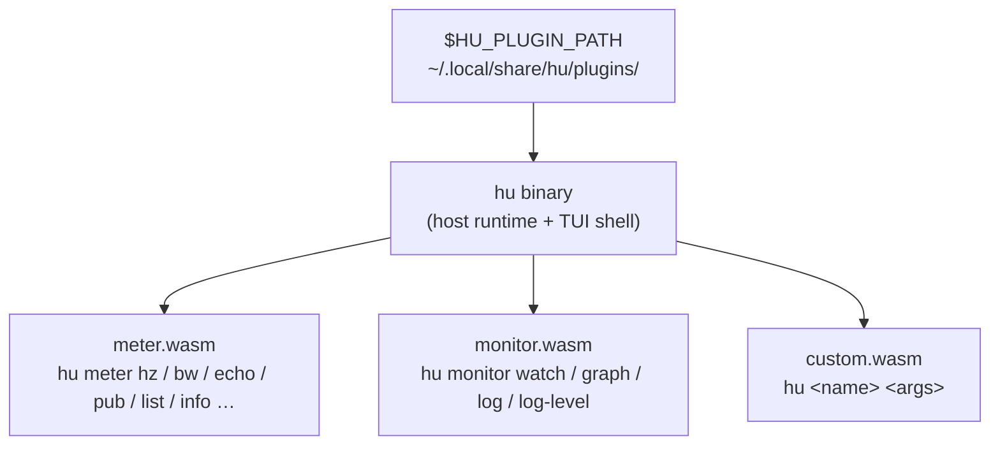

# hu — Hiroz Union

`hu` is the command-line companion to the hiroz stack. It replaces `ros2 topic`, `ros2 node`, `ros2 service`, `ros2 action`, and `ros2 param` with a daemon-free, plugin-based tool that works directly over Zenoh — no DDS, no Python, no background process. Subcommands like `meter` and `monitor` are WASM plugins; you can ship your own by dropping a `.wasm` file into `~/.local/share/hu/plugins/`.

## Terminology

A few terms recur throughout this page:

- **Zenoh router** — the process (`zenohd`, or `rmw_zenohd` when bundled with `rmw_zenoh_cpp`) that lets `hu` and ROS 2 nodes discover and reach each other; `hu` always connects to one, it never uses peer-to-peer discovery.
- **Domain ID** — a numeric namespace (default `0`) that partitions independent ROS 2 graphs sharing the same router.
- **Liveliness** — Zenoh's mechanism for announcing and detecting when a node, topic, or service appears or disappears, which is how `hu` builds its live graph view without polling.
- **CDR** — Common Data Representation, the binary wire format ROS 2 messages are serialized to; `hu meter` decodes and encodes it directly.
- **RMW** — the ROS Middleware interface; `rmw_zenoh_cpp` is the RMW implementation that lets standard ROS 2 nodes talk over Zenoh, which is what makes them visible to `hu`.

## Installation

### Pre-built binary

**Forthcoming.** Pre-built `hu` binaries are not yet published by the release workflow — the current [Releases page](https://github.com/ZettaScaleLabs/hiroz/releases) does not include a standalone `hu` artifact. Until they land, build from source (see below). Planned artifact names, once the release job builds them:

| Platform | File |
|---|---|
| Linux x86_64 | `bin-hu-x86_64-linux` |
| Linux aarch64 | `bin-hu-aarch64-linux` |
| macOS aarch64 | `bin-hu-aarch64-macos` |

`hu` has no ROS 2 dependency — it works with any [`rmw_zenoh_cpp`](https://github.com/ros2/rmw_zenoh) or hiroz deployment.

**Note:** the `meter` and `monitor` subcommands are WASM plugins loaded from the plugin path, not part of the `hu` binary, and the reference plugins are **not yet bundled in the release artifacts**. To use them today you need the Rust toolchain with the `wasm32-wasip2` target, build the plugins from source (see below), and point `HU_PLUGIN_PATH` at them; verify with `hu plugin list`. The single-binary `hu` still gives you the TUI, `stream`, `router`, and `plugin` management commands with no ROS 2 install.

### Build from source

Requires Rust 1.85+ and the `wasm32-wasip2` target (used to build the plugins). With the Nix dev environment, enter the wasm-capable shell — it already has the target:

```bash
nix develop .#pureRust-wasm
```

Without Nix, add the target to your toolchain:

```bash
rustup target add wasm32-wasip2
```

**1. Build the `hu` binary:**

```bash
cargo build -p hiroz-union --release
# → ./target/release/hu   (or install it: cargo install --path crates/hiroz-union)
./target/release/hu --help
```

**2. Build the `meter` / `monitor` plugins.** These are **WASM plugins, not part of the `hu` binary**, so `hu meter …` and `hu monitor …` do nothing until their `.wasm` files are on the plugin path. Build them with the `cargo hu-plugins` alias:

```bash
cargo hu-plugins --release
```

That's shorthand for `cargo build --manifest-path crates/hiroz-union/plugins/Cargo.toml --target wasm32-wasip2 --workspace`. The plugins are a separate wasm workspace, so you can also `cd crates/hiroz-union/plugins && cargo build --release` (the target defaults to `wasm32-wasip2` there).

**3. Put the plugins on the plugin path** — either point `HU_PLUGIN_PATH` at the build output, or copy the `.wasm` files into `~/.local/share/hu/plugins/` (the always-searched dir). The `hu_`/`hu-` prefix is stripped on discovery, so `hu_meter.wasm` becomes `meter`:

```bash
export HU_PLUGIN_PATH=$PWD/crates/hiroz-union/plugins/target/wasm32-wasip2/release
# or, to install permanently:
#   mkdir -p ~/.local/share/hu/plugins
#   cp crates/hiroz-union/plugins/target/wasm32-wasip2/release/hu_{meter,monitor}.wasm ~/.local/share/hu/plugins/

hu plugin list          # verify — should list `meter` and `monitor`
```

If `hu plugin list` is empty, `hu meter`/`hu monitor` won't work — the plugins aren't being found on the path.

## Quick start

This walks through a real end-to-end session: a router, a talker/listener pair, and `hu` observing them. Run each step in its own terminal.

!!! note "Prerequisite"
    This uses `hu meter` and `hu monitor`, which are plugins — make sure `hu plugin list` shows `meter` and `monitor` first. If it's empty, build the plugins and set `HU_PLUGIN_PATH` as described under [Build from Source](#build-from-source).

**Terminal 1 — start the Zenoh router:**

```bash
hu router
```

**Terminal 2 — start a hiroz listener:**

```bash
cargo run --example z_pubsub -- --role listener
```

**Terminal 3 — start a hiroz talker:**

```bash
cargo run --example z_pubsub -- --role talker
```

Both examples connect to `tcp/127.0.0.1:7447` (never bare peer discovery — see [`examples/z_pubsub.rs`](https://github.com/ZettaScaleLabs/hiroz/blob/main/crates/hiroz/examples/z_pubsub.rs)), and publish/subscribe on `/chatter`.

**Terminal 4 — observe with `hu`:**

```bash
# List all topics
hu meter list topics
# /chatter (std_msgs/msg/String)

# Measure the talker's publish rate
hu meter hz /chatter
# rate: 1.001 Hz

# Watch the live graph
hu monitor watch
# node appeared:  /talker
# node appeared:  /listener
# topic appeared: /chatter
```

By default `hu` connects to `tcp/127.0.0.1:7447` and uses domain ID `0` — matching the talker/listener above. Override with flags or environment variables:

```bash
hu --connect tcp/192.168.1.10:7447 --domain 5 meter list topics
```

Or set them once for the session:

```bash
export HU_CONNECT=tcp/192.168.1.10:7447
export HU_DOMAIN=5
hu meter hz /chatter
```

`HU_CONNECT` and `HU_DOMAIN` fully replace the `--connect` / `--domain` flags — once exported, every `hu meter` / `hu monitor` invocation reaches that router with no per-command flags, which is the recommended workflow for an interactive session:

```bash
export HU_CONNECT=tcp/127.0.0.1:7447
hu meter list topics      # no --connect needed
hu monitor graph          # same session, same router
```

### More examples

The Quick Start covers `list`, `hz`, and `watch`. The subcommands below are the least self-explanatory ones — each transcript shows the exact command and the output line to expect. These paths are exercised by the integration suite (`crates/hiroz-tests/tests/hu_meter.rs`, `hu_monitor.rs`).

**Call a service** (against an `AddTwoInts` server on `/add_two_ints`):

```bash
# --yaml takes the request as inline YAML; --msg-type names the request type.
hu meter service call /add_two_ints \
  --yaml '{a: 20, b: 22}' \
  --msg-type example_interfaces/srv/AddTwoInts_Request \
  --timeout 10
# {"sum": 42}
```

The response prints as JSON, so it pipes straight into `jq`:

```bash
hu meter service call /add_two_ints --yaml '{a: 20, b: 22}' \
  --msg-type example_interfaces/srv/AddTwoInts_Request | jq '.sum'
# 42
```

**Round-trip a parameter** (set then read it back):

```bash
hu meter param set /talker publish_period_ms 500
# OK

hu meter param get /talker publish_period_ms --json
# {"publish_period_ms": 500}
```

**Describe a parameter** as JSON (every meter subcommand supports `--json` for scripting):

```bash
hu meter param describe /talker publish_period_ms --json
# {"name":"publish_period_ms","value":500}
```

**Stream action feedback** while a goal runs:

```bash
hu meter action echo /fibonacci \
  --msg-type example_interfaces/action/Fibonacci --count 3
# [/fibonacci/_action/feedback] {"partial_sequence": [0, 1, 1]}
# [/fibonacci/_action/feedback] {"partial_sequence": [0, 1, 1, 2]}
# [/fibonacci/_action/feedback] {"partial_sequence": [0, 1, 1, 2, 3]}
```

**Get / set a node's log level** with `hu monitor`:

```bash
# Read the current logger levels for /talker.
hu monitor log-level /talker
# log levels: {"levels": [{"name": "talker", "level": 20}]}

# Set it to DEBUG (subsequent /rosout traffic reflects the new level).
hu monitor log-level /talker DEBUG
# set log level to DEBUG

# Follow /rosout, stopping after 2 messages.
hu monitor log --count 2
# [rosout] ...
# [rosout] ...

# Omit --count to stream every /rosout message indefinitely (Ctrl-C to stop).
hu monitor log
# [rosout] ...
# [rosout] ...
# ...
```

> `hu monitor log-level` talks to the target node's `get_logger_levels` / `set_logger_levels` services (`rcl_interfaces`), so the node must expose them — standard `rclcpp`/`rclpy` nodes do; the pure-hiroz demo nodes do not yet.

---

## Why hu instead of ros2cli?

`ros2cli` carries a set of well-known pain points — a background daemon that goes stale or crashes, Python-bound rate measurement that undercounts at high frequency, silent QoS-mismatch drops, service calls with no timeout, slow startup on embedded hardware, and fragile nested-YAML publishing. `hu` addresses all of these with a daemon-free, compiled, Zenoh-native design.

See [Why hu instead of ros2cli?](why-hu.md) for the full comparison with issue references and before/after examples.

---

## Summary

| Pain point | ros2cli | hu |
|---|---|---|
| Daemon crashes / stale state | ❌ common | ✅ no daemon |
| Rate measurement accuracy | ❌ Python deserialization bottleneck | ✅ raw Zenoh bytes |
| QoS mismatch warning | ❌ silent drop | ✅ explicit warning |
| Service call timeout | ❌ hangs forever | ✅ `--timeout` flag |
| Startup time (embedded HW) | ❌ 7+ seconds | ✅ <10 ms |
| Nested YAML in topic pub | ❌ fails silently | ✅ CDR-aware encoding |
| Works without ROS 2 install | ❌ requires full ROS 2 | ✅ only needs a Zenoh router |

---

## Subcommands

### hu meter

Measurement and introspection:

| Command | Description |
|---|---|
| `hu meter hz <topic>` | Publish rate (sliding window) |
| `hu meter bw <topic>` | Bandwidth in KB/s |
| `hu meter echo <topic>` | Print arriving messages |
| `hu meter echo <topic> --raw` | Hex-dump raw CDR bytes, bypassing schema decode (requires the `access-raw-cdr` permission) |
| `hu meter delay <topic>` | End-to-end latency |
| `hu meter pub <topic>` | Publish a message |
| `hu meter list topics\|nodes\|services` | Enumerate graph entities |
| `hu meter info topic\|node\|service <name>` | Full entity introspection |
| `hu meter service call <name> --yaml <yaml> --msg-type <type> [--timeout <s>]` | Call a service |
| `hu meter param list\|get\|dump\|describe\|set\|load <node> [...]` | Read and write node parameters, or bulk-load from a ROS-style YAML params file (`load <node> <yaml-file>`). `load` is host-handled: `hu` reads and parses the YAML on the host (WASM plugins have no filesystem access) and hands the plugin pre-flattened parameter data. There is no `delete` verb — parameter deletion (`ros2 param delete`) is not implemented. |
| `hu meter action list` | List available actions |
| `hu meter action info <name>` | Show an action's type and server count |
| `hu meter action send-goal <name> --payload <hex> [--timeout <s>]` | Send a goal from raw hex-encoded CDR bytes, and poll for the result. This is the only way to send a goal — there is no JSON-goal verb; unlike `hu meter service call --yaml`, goals are not accepted in a human-authored form. |
| `hu meter action echo <name> --msg-type <type> [--count <n>]` | Echo action feedback messages |

### hu monitor

Observation and diagnostics:

| Command | Description |
|---|---|
| `hu monitor watch` | Stream live graph change events |
| `hu monitor graph` | Snapshot the current graph |
| `hu monitor log [--count <n>]` | Tail `/rosout` |
| `hu monitor log-level <node> [<level>]` | Read or change a node's logger level |

### hu plugin

Plugin management:

| Command | Description |
|---|---|
| `hu plugin list` | List all loaded `.wasm` plugins with name and path |
| `hu plugin validate <path>` | Validate that a `.wasm` file compiles as a WASM component |

---

## Multi-topic rate dashboard

For continuous monitoring of several topics at once, use the `hu` TUI. Select topics in the Topics panel and press `m` to add them to the Measure panel, which shows a live, per-second rate and bandwidth table for every topic you're tracking — all in one process, instead of one `ros2 topic hz` per topic:

```bash
hu
```

Bare `hu` launches the TUI; use `Tab`/`1`–`5` to reach the Measure panel. This is the primary advantage over `ros2 topic hz`, which needs a separate terminal per topic and no combined view.

### TUI keybindings

| Key | Action |
|---|---|
| `Tab` / `Shift+Tab` | Cycle panels (Topics, Services, Nodes, Measure, Plugins) |
| `1`–`5` | Jump directly to a panel |
| `↑`/`k`, `↓`/`j` | Move selection |
| `Enter` / `Space` | Expand/focus the selected item's detail |
| `/` | Enter filter mode (type-ahead search) |
| `r` | Quick rate check on the selected topic (Topics panel) or clear tracked rates (Measure panel) |
| `m` | Toggle the selected topic or service into the Measure panel's tracking list |
| `w` | Start/stop recording metrics |
| `e` | Export the current rate cache to a timestamped CSV file |
| `S` | Capture a screenshot of the current TUI state |
| `t` | Tick the selected plugin (Plugins panel) |
| `R` | Reload plugins — rescan the plugin directories live, no restart (Plugins panel) |
| `?` | Toggle the help overlay |
| `q` / `Ctrl+C` | Quit |

When a TUI plugin's output pane is focused (select it on the Plugins panel and press `l`/`Enter`), keystrokes are sent to the plugin as `key-action` events instead of driving the TUI — press `Esc` (or `←`/`h`) to return control to the list.

---

## JSON output

Every `hu meter` subcommand accepts `--json` for scripting:

```bash
hu meter hz /scan --duration 5 --json | jq '.rate_hz'
hu meter list topics --json | jq '.[].name'
hu meter info node /talker --json | jq '.publishers[].name'
```

---

## Stream mode

`hu stream` streams graph change events to stdout without opening a TUI. Useful for piping into log aggregators, CI scripts, or dashboards that can't host a terminal.

It first prints the current graph as a snapshot, then one line per change event, each prefixed with a UTC timestamp. Type names appear in their DDS-mangled form (`std_msgs::msg::dds_::String_`), not the ROS `std_msgs/msg/String` form:

```bash
hu stream
# Discovered Topics:
#   topic: /chatter (std_msgs::msg::dds_::String_)
# Discovered Services:
#   service: /talker/get_parameters (rcl_interfaces::srv::dds_::GetParameters_)
# Discovered Nodes:
#   node: //talker
# [2026-08-04 07:42:06] Node discovered: /talker
# [2026-08-04 07:42:06] Topic discovered: /chatter (std_msgs::msg::dds_::String_)
```

!!! note "The doubled slash in the snapshot's node lines"
    Snapshot node lines are printed as `<namespace>/<name>`, and a node in the root namespace has the namespace `/` — so it renders as `//talker`, not `/talker`. The event lines below use the raw namespace instead and print `/talker`. `hu` itself joins the graph while streaming, so it appears alongside your nodes.

Add `--json` for structured output. The first line is the initial snapshot, keyed `event`; every line after it is a single `SystemEvent` in serde's externally-tagged form, where the variant name is the sole top-level key:

```bash
hu stream --json
# {"event":"initial_state","timestamp":{"secs_since_epoch":1785829316,"nanos_since_epoch":522800352},"domain_id":0,"topics":[{"name":"/chatter","type":"std_msgs::msg::dds_::String_","publishers":1,"subscribers":0}],"nodes":[{"name":"talker","namespace":"/"}],"services":[{"name":"/talker/get_parameters","type":"rcl_interfaces::srv::dds_::GetParameters_"}]}
# {"NodeDiscovered":{"namespace":"","name":"talker","timestamp":{"secs_since_epoch":1785829316,"nanos_since_epoch":522703282}}}
# {"TopicDiscovered":{"topic":"/chatter","type_name":"std_msgs::msg::dds_::String_","timestamp":{"secs_since_epoch":1785829316,"nanos_since_epoch":522693292}}}
```

The arrays are shown with one entry each for brevity; a real graph also carries `/parameter_events` and each node's parameter services.

Because the variant name is the key rather than a `type` field, filtering with `jq` selects on key presence:

```bash
hu stream --json | jq -c 'select(has("TopicDiscovered")) | .TopicDiscovered.topic'
```

The event variants are `TopicDiscovered`, `TopicRemoved`, `RateMeasured`, `NodeDiscovered`, `NodeRemoved`, `ServiceDiscovered` and `MetricsSnapshot`.

Two field-naming traps when writing filters:

- The snapshot's per-topic and per-service type field is `type`; the event payloads use `type_name`.
- A root-namespace node is reported as `"namespace":"/"` in the snapshot but `"namespace":""` in `NodeDiscovered`/`NodeRemoved` — the snapshot normalises the empty namespace, the events do not. Joining namespace and name naively will produce `//talker` from the snapshot.

Add `--echo <TOPIC>` to also subscribe to a topic and interleave decoded messages. `--echo` can be repeated for multiple topics:

```bash
hu stream --json --echo /scan --echo /cmd_vel
```

!!! note
    `hu stream` replaces the deprecated `--headless` flag, which still works as a hidden alias for now.

---

## Web mode

`hu web` starts an HTTP server (default port 8080) that dispatches requests to `hu-web-plugin` WASM plugins. Requires `hu` built with the `web-plugins` feature:

```bash
hu web                # listen on 0.0.0.0:8080
hu web --port 9090    # listen on 0.0.0.0:9090
```

Each web plugin is reachable at `/plugins/<name>/` and `/plugins/<name>/*path`. The plugin handles the full HTTP request/response cycle (see [hu Plugin Authoring Guide](hu-plugins.md)).

!!! note
    `hu web` replaces the deprecated `--web [PORT]` flag, which still works as a hidden alias for now.

---

## Running a router

`hu router` starts an embedded Zenoh router configured to match `rmw_zenoh_cpp`, so you don't need a separate `zenohd` install or the `cargo run --example zenoh_router` helper for local development. It listens on `tcp/[::]:7447` by default and runs until Ctrl-C:

```bash
hu router                              # listen on tcp/[::]:7447
hu router --listen tcp/0.0.0.0:7448    # custom endpoint (repeatable)
hu router --config router.json5        # full JSON5/YAML config, overrides --listen
```

Point every other `hu` command (and your ROS 2 / hiroz nodes) at it with `--connect` / `HU_CONNECT`. For production deployments, prefer the bundled [`rmw_zenohd`](https://github.com/ros2/rmw_zenoh) or a standalone `zenohd`.

## Additional flags

| Flag | Default | Description |
|---|---|---|
| `--connect <endpoint>` | `tcp/127.0.0.1:7447` | Zenoh router endpoint to connect to (also `HU_CONNECT`) |
| `--domain <id>` | `0` | ROS 2 domain ID (also `HU_DOMAIN`) |
| `--backend <name>` | `rmw-zenoh` | Select the graph/RMW backend (currently only `rmw-zenoh`). Not a mode switch — pick a mode with the `tui`/`web`/`stream` subcommands |
| `--json` | — | Structured JSON output — affects `hu stream` event streaming, `hu plugin list` output, and log formatting |
| `--echo <TOPIC>` | — | Subscribe to topic and stream messages (`hu stream`, repeatable) |
| `--export <path>` | — | Write a graph snapshot to a file and exit (format from the extension — see below) |
| `--debug` | — | Enable verbose debug logging to stderr |

### Export formats

`--export <path>` picks the output format from the file extension:

| Extension | Output |
|---|---|
| `.json` | Pretty-printed graph snapshot (nodes, topics, services) |
| `.dot` | Graphviz digraph — render with e.g. `dot -Tpng graph.dot -o graph.png` |
| `.csv` | Flat CSV rows of the graph entities |

Any other extension is rejected with an "Unsupported export format" error.

The run mode is chosen by subcommand — `hu` (or `hu tui`) for the TUI, `hu web` for the HTTP server, `hu stream` for JSON streaming. The old `--web` / `--headless` flags still work as hidden, deprecated aliases.

---

## Plugin architecture

`hu` is a plugin host. `meter` and `monitor` are not built-in subcommands — they are WASM plugins compiled to `wasm32-wasip2` and loaded at startup from `$HU_PLUGIN_PATH` and `~/.local/share/hu/plugins/`. The `hu` binary itself provides the native pieces the sandbox can't: the **frontends** that run and render plugins (`tui`, `web`, `stream`, and the one-shot CLI — each the host side of a WIT world), and the **management** commands `router` (binds a socket to serve an embedded Zenoh router) and `plugin` (lists/validates installed plugins). See the [platform overview](why-hu.md#the-ecosystem-at-a-glance) for how frontends, plugins, and management fit together.



Any team can ship a `hu-<name>.wasm` file and it becomes a `hu <name>` subcommand with no build-system changes, no Python packaging, and no shared runtime state:

```bash
# Drop a .wasm file and it becomes available immediately
cp ./my-debug-tool.wasm ~/.local/share/hu/plugins/
hu plugin list          # shows all loaded plugins with name and path
hu my-debug-tool --help
```

Plugins are sandboxed: they declare the capabilities they need (subscriptions, raw CDR, additional Zenoh sessions) in a manifest, and the host refuses calls for anything undeclared. Plugins also never manage Zenoh connections directly — the host opens all sessions declared in the plugin's manifest before the first event fires. The same `.wasm` binary runs as a TUI panel and as a CLI subcommand.

See [hu Plugin Authoring Guide](hu-plugins.md) for the WIT interface reference and a worked example.
