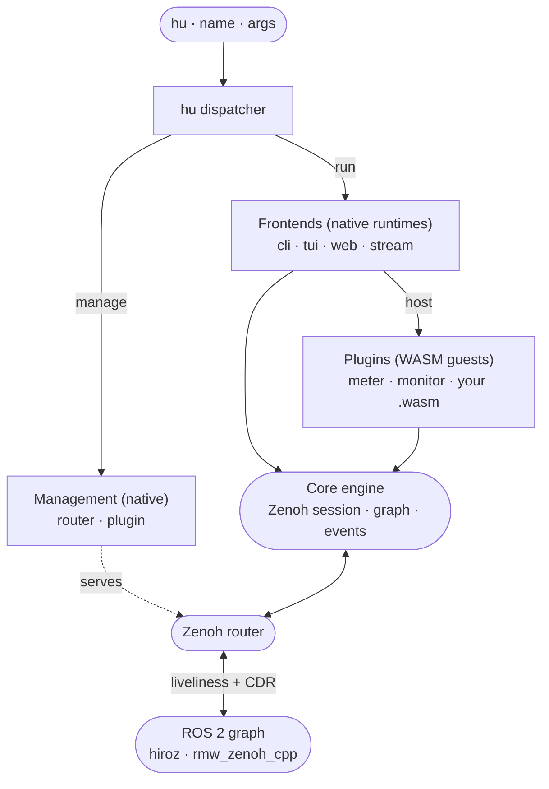

# hu Toolkit — Overview

`hu` — short for **H**iroz **U**nion, and the crate that builds it is [`hiroz-union`](https://github.com/ZettaScaleLabs/hiroz/tree/main/crates/hiroz-union) — is the tooling ecosystem for the hiroz stack: a single, daemon-free binary that talks directly to Zenoh and grows through WebAssembly plugins. It replaces `ros2 topic`, `ros2 node`, `ros2 service`, `ros2 action`, `ros2 param`, and much of `rqt` — but the more important idea is that most of what `hu` does, including the observation and measurement commands that ship in the box, is delivered as **plugins**. This page introduces that ecosystem; the rest of this section drills into each part.

## The ecosystem at a glance

`hu` is a platform, not a monolith. A thin dispatcher routes `hu <name> <args>` to one of three things, all layered over a shared **core engine**:

- **Frontends** — native runtimes that present the platform and own their I/O: `tui` (interactive terminal — also what bare `hu` runs), `web` (HTTP server), `stream` (newline-delimited JSON events), and the one-shot **CLI**. A frontend owns the core engine and *hosts the plugins that target it*.
- **Plugins** — sandboxed WebAssembly components that do the ROS 2 work. Each targets one frontend through a WIT world: a CLI command (`meter`, `monitor`, or your own), a TUI pane, or a web handler. The shipped `meter`/`monitor` are plugins compiled into the binary; third-party plugins are `.wasm` files you drop into a directory — the same contract either way.
- **Management** — native commands for platform infrastructure that touch no graph: `router` (run an embedded Zenoh router) and `plugin` (list/validate installed plugins).

The relationship that ties it together: a **frontend is the native host side** of an interaction surface, and a **plugin is the sandboxed guest side** of that same surface. That is why the WIT worlds line up one-to-one with the frontends:

| Frontend (native) | Guest contract (WIT world) | A plugin here is… | Status |
|---|---|---|---|
| `cli` | `hu-cli-plugin` | a `hu <name>` command (`meter`, `monitor`, yours) | ✅ shipped |
| `web` | `hu-web-plugin` | an HTTP route handler | 🟡 landing soon (host wired, no reference plugin) |
| `tui` | `hu-tui-plugin` | a pane in the TUI | 🟡 landing soon (loads + renders; interactive events not yet forwarded) |
| `stream` | *(none)* | — (a raw dump of the core event bus) | ✅ shipped |



The moving parts:

- **Dispatcher** — `hu` parses the first argument and routes it to a frontend, a plugin (via the CLI frontend), or a management command. It owns no ROS logic itself.
- **Core engine** — one shared `CoreEngine`: the Zenoh session, the live graph built from the liveliness index, the event bus. Every frontend and plugin sits on it; there is no `_ros2_daemon` and no DDS discovery.
- **Frontends** — native, trusted runtimes. `tui` owns the terminal and renders tui-plugins as panes; `web` serves web-plugins as routes; `cli` runs one cli-plugin and exits; `stream` dumps core events as JSON. They are native (not plugins) because they need full host access — the terminal, the runtime, the sessions — which the sandbox withholds.
- **Plugins** — `meter` (measurement: `hz`, `bw`, `delay`, `echo`, `pub`, `list`, `info`, service/action/param) and `monitor` (observation: `watch`, `graph`, `log`, `log-level`) ship compiled in; any `.wasm` in `$HU_PLUGIN_PATH` or `~/.local/share/hu/plugins/` becomes a `hu <name>` command with no registration step, no Python entry-points, and no shared runtime state.
- **Management** — `router` starts an embedded Zenoh router (see [Running a router](hu.md#running-a-router)); `plugin` lists and validates installed plugins. Native infrastructure, no graph involvement.
- **Sandbox** — WASM plugins are capability-gated: a plugin only gets the host access (topic subscription, file, bag) it is explicitly granted. Frontends and management are the deliberate native exceptions.

Read on for [why this design beats the Python-based tools](#the-problem-with-existing-cli-tools), the [full command reference](hu.md), and [how to write your own plugin](hu-plugins.md).

---

## The problem with existing CLI tools

ROS 2 ships two standard toolsets: `ros2cli` for the terminal and `rqt` for the GUI. Both are implemented in Python and built on top of RCL (the ROS Client Library). This means they carry the full cost of the Python ROS 2 stack — a background daemon, DDS discovery, Python message deserialization — even for the simplest operations.

| Pain point | ros2cli behavior | Effect on user |
|---|---|---|
| **Fragile daemon** | Spawns `_ros2_daemon` on first use; snapshots `ROS_DOMAIN_ID`/`RMW_IMPLEMENTATION` at startup ([ros2cli#1238](https://github.com/ros2/ros2cli/issues/1238), [#502](https://github.com/ros2/ros2cli/issues/502), [#934](https://github.com/ros2/ros2cli/issues/934)) | New terminal with different domain ID silently queries the wrong domain; daemon crashes on enterprise networks; WSL2/container health check fails; fix is always `pkill -f _ros2_daemon` |
| **Inaccurate rate measurement** | `ros2 topic hz` deserializes every message in Python inside the GIL ([ros2cli#871](https://github.com/ros2/ros2cli/issues/871), [#1043](https://github.com/ros2/ros2cli/issues/1043)) | Saturates below ~1.4 kHz on a 64 kHz burst publisher (41× under-read); camera topics at 30 fps report 15–22 fps |
| **No machine-readable output** | All `ros2` commands emit human-formatted text with no stable format | Parsing requires string-splitting on `/` and column counting; breaks across ROS 2 versions |
| **Requires a full ROS 2 install** | Depends on RCL, Python stack, and sourced `setup.bash` | CI pipelines and developer laptops without a distro must carry a full Docker image |

---

## What hu does differently

`hu` connects directly to the Zenoh router that underlies the hiroz stack. It does not use RCL, does not start a daemon, and does not deserialize messages in Python.

| What hu does | How |
|---|---|
| No daemon, always fresh | Every invocation opens a Zenoh session, reads the live liveliness index, and exits — always a real-time snapshot |
| Byte-level measurement | `hu meter hz` / `hu meter bw` timestamp arrivals at the raw Zenoh byte layer; a 100 MB point cloud costs the same to count as a 10-byte string |
| JSON output everywhere | Every subcommand accepts `--json` and emits newline-delimited JSON; composable with `jq`, shell scripts, and CI harnesses without fragile text parsing |
| Plugin extensibility | Drop a `.wasm` file into `$HU_PLUGIN_PATH` or `~/.local/share/hu/plugins/` and it becomes a `hu <name>` subcommand; no Python entry-points, no `setup.cfg`, no shared runtime state; plugins are sandboxed and capability-gated |

**JSON output on every command** makes it composable with `jq`, shell scripts, CI harnesses, and log pipelines without fragile text parsing:

```bash
# Check camera rate in CI
rate=$(hu meter hz /camera/image_raw --duration 5 --json | jq '.rate_hz')
[ "$(echo "$rate > 28.0" | bc)" = "1" ] || exit 1

# Stream graph events to a log file
hu monitor watch --json >> /var/log/ros-graph-events.jsonl
```

---

## What hu does not do

`hu` only works with the hiroz stack and `rmw_zenoh_cpp`. It cannot see nodes that use `rmw_fastrtps_cpp` or `rmw_cyclonedds_cpp`. If your system has a mix of RMW implementations, `ros2 topic hz` will see topics that `hu meter hz` cannot.

There is no `hu launch`, no `hu pkg`, and no `hu run`. `hu` is scoped to graph introspection, measurement, and bridging — the operations that the Python-based tools do poorly at scale.

---

## When to switch

| Condition | Use `hu` | Use `ros2cli` |
|---|---|---|
| RMW implementation | `rmw_zenoh_cpp` or pure hiroz | `rmw_fastrtps_cpp` or `rmw_cyclonedds_cpp` |
| Rate measurement above 500 Hz | yes | no — Python GIL saturates |
| CLI tools in CI / automation | yes — `--json` on every command | fragile text parsing |
| No ROS 2 install available | yes — single binary | no — requires distro + `setup.bash` |
| Live graph events without polling | yes — `hu monitor watch` | no — must poll `ros2 node list` |
| `ros2 launch` / `ros2 pkg` / `ros2 run` | not planned | yes |
| Nodes on non-Zenoh RMW | no — invisible to `hu` | yes |

---

## Next steps

- [hu reference](hu.md) — full command reference
- [hu vs. ros2cli / rqt](hu-vs-ros2cli.md) — feature-by-feature comparison with benchmark data
- [hu Plugin Authoring](hu-plugins.md) — write your own `hu <name>` command as a WASM plugin
