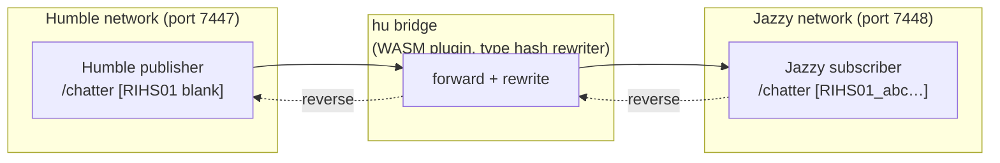

# Cross-Distro Bridge

The cross-distro bridge lets Humble and Jazzy (or Kilted / Lyrical) ROS 2 nodes communicate through a Zenoh router, even though the two generations use incompatible key expression formats.

## Background

ROS 2 Humble and Jazzy use different type hash formats in their Zenoh key expressions:

- Humble: type hash field is blank (`TypeHashNotSupported`)
- Jazzy and later: type hash is a `RIHS01_…` string

A Jazzy subscriber's key expression therefore does not match a Humble publisher's key expression, so Zenoh delivers no messages and no error — discovery simply fails silently. The bridge rewrites the type hash segment on the fly so both sides match.

## How it works

`hu bridge` is a WASM plugin (`hu-bridge.wasm`). When running, it opens two named Zenoh sessions (one per distro endpoint) and forwards messages between them, rewriting key expression segments to make the type hashes compatible.



The bridge is bidirectional: Jazzy clients reach Humble servers and vice versa. Topics, services, and actions are all forwarded.

## Usage

```bash
# Bridge a Humble router (port 7447) to a Jazzy router (port 7448)
hu bridge start --distro humble:jazzy \
  --source-endpoint tcp/127.0.0.1:7447 \
  --target-endpoint tcp/127.0.0.1:7448

# Check what the bridge is currently forwarding
hu bridge status
```

`hu bridge` inherits `HU_ROUTER` and `HU_DOMAIN` from the environment (or the `--router` / `--domain` flags). The `--source-endpoint` and `--target-endpoint` flags override the session endpoints for each side.

## Installing the bridge plugin

`hu-bridge.wasm` is built from the `hiroz-bridge` crate and is not bundled in the `hu` binary. Build and install it once:

```bash
# Build the bridge plugin (cross-distro feature only — avoids cyclors dep)
cargo build -p hiroz-bridge --no-default-features --features cross-distro \
  --target wasm32-wasip2 --release

# Install
mkdir -p ~/.local/share/hu/plugins
cp target/wasm32-wasip2/release/hiroz_bridge.wasm \
   ~/.local/share/hu/plugins/hu-bridge.wasm

# Verify it loaded
hu plugin list
```

After installation `hu bridge` is available as a subcommand.

## Supported distro pairs

| Pair | Notes |
|---|---|
| Humble ↔ Jazzy | Stable — tested in CI |
| Humble ↔ Kilted | Same as Jazzy (both use RIHS01_ hashes) |
| Jazzy ↔ Kilted | No bridge needed — both use the same hash format |

## Limitations

- The bridge operates at the Zenoh key expression layer. QoS policies are not translated — if a Humble publisher uses `BEST_EFFORT` and a Jazzy subscriber requires `RELIABLE`, the bridge forwards packets but the QoS event fires on the subscriber side.
- Large message types require the bridge to have access to the type hash for both distros. The bridge reads type hashes from a manifest bundled in the plugin; types not in the manifest fall back to key-expression prefix matching without hash rewriting.
- Cross-DDS bridging (e.g. Fast-DDS ↔ Zenoh) is not supported by this plugin. For DDS interop, use `rmw_zenoh_cpp` on the DDS side with a standard Zenoh router.
