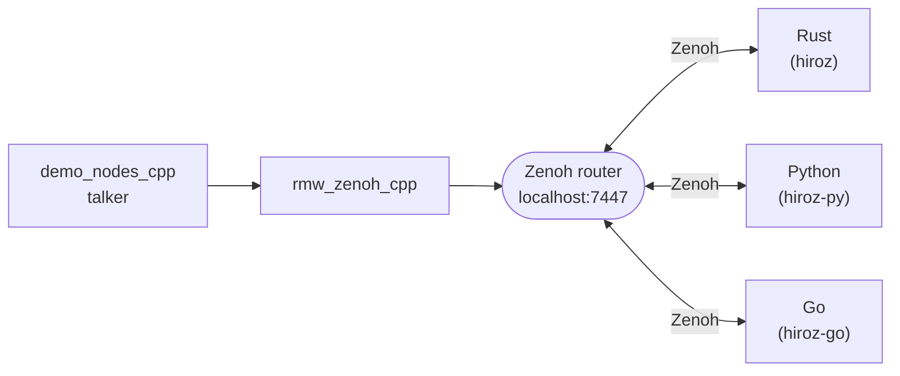

# ROS 2 Interoperability

hiroz nodes — whether written in Rust, Python, or Go — speak the same Eclipse Zenoh wire protocol as [`rmw_zenoh_cpp`](https://github.com/ros2/rmw_zenoh), the official ROS 2 middleware plugin for Zenoh. This means they interoperate transparently: a Go subscriber can receive messages from a ROS 2 C++ talker, a Python publisher can send to a Rust listener, and so on.

!!! tip "Mixing Humble with Jazzy, Kilted, or Lyrical?"
    If you need to bridge a **Humble** (legacy) network and a **Jazzy / Kilted / Lyrical** (modern) network, use `hu bridge start`. See the [Cross-Distro Bridge](./bridge.md) chapter for details.

## Prerequisites

- A ROS 2 installation with [`rmw_zenoh_cpp`](https://github.com/ros2/rmw_zenoh) and `demo_nodes_cpp`
- A Zenoh router running on `localhost:7447` (see [Networking](./networking.md))

## How It Works

All participants connect to the same Zenoh router on the local machine.



!!! note
    The Zenoh router can be [`rmw_zenohd`](https://github.com/ros2/rmw_zenoh), `zenohd`, `cargo run --example zenoh_router`, or Docker.
    See [Networking](./networking.md) for all options.

**Requirements for successful message exchange:**

- Both sides must use the same message type with matching RIHS01 type hashes
- ROS 2 nodes must use [`rmw_zenoh_cpp`](https://github.com/ros2/rmw_zenoh) (`export RMW_IMPLEMENTATION=rmw_zenoh_cpp`)

!!! warning
    If type hashes differ (e.g. mismatched message definitions), nodes silently drop messages.
    Enable `RUST_LOG=hiroz=debug` to inspect the hash in the key expression and compare with the ROS 2 side.
    See [Troubleshooting](../reference/troubleshooting.md) for diagnosis steps.

## Setup

```bash
# Terminal 1 — router
ros2 run rmw_zenoh_cpp rmw_zenohd

# Terminal 2 — ROS 2 talker
export RMW_IMPLEMENTATION=rmw_zenoh_cpp
ros2 run demo_nodes_cpp talker

# Terminal 3 — hiroz listener (see Rust / Python / Go below)
```

---

## Rust

```bash
cargo run --example demo_nodes_listener
```

For more detail on publisher/subscriber patterns see [Pub/Sub](../core-concepts/pubsub.md).

---

## Python

If you installed via **pip** (pre-built wheel), write your own `listener.py` using the code in [Python Quick Start](../bindings/python-quick-start.md) and run it with `python listener.py`.

If you cloned the repository (build from source), use the bundled example:

```bash
cd crates/hiroz-py
source .venv/bin/activate
python examples/topic_demo.py -r listener
```

Or go the other way — Python publishes, ROS 2 listens:

```bash
python examples/topic_demo.py -r talker
# On ROS 2 side:
ros2 topic echo /chatter std_msgs/msg/String
```

For more detail see [Python Bindings](../bindings/python.md).

---

## Go

```bash
just -f crates/hiroz-go/justfile run-example subscriber
```

For more detail see [Go Quick Start](../bindings/go-quick-start.md).
